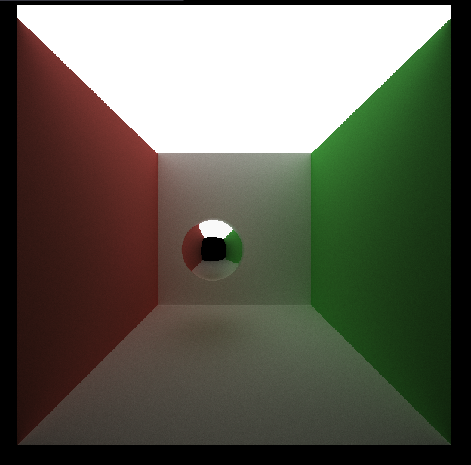
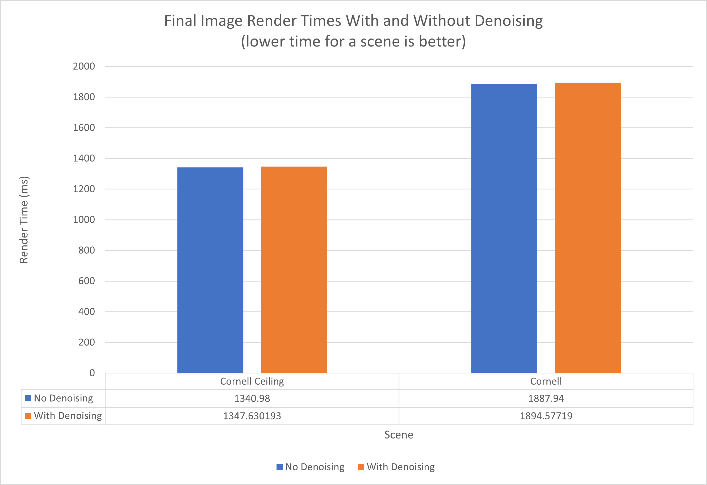
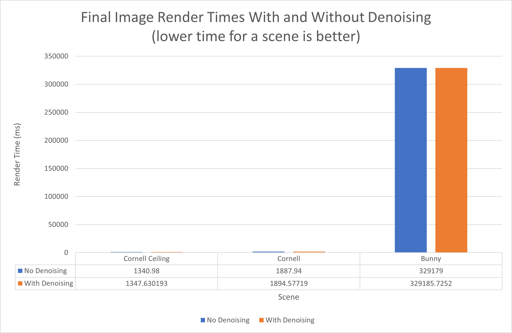
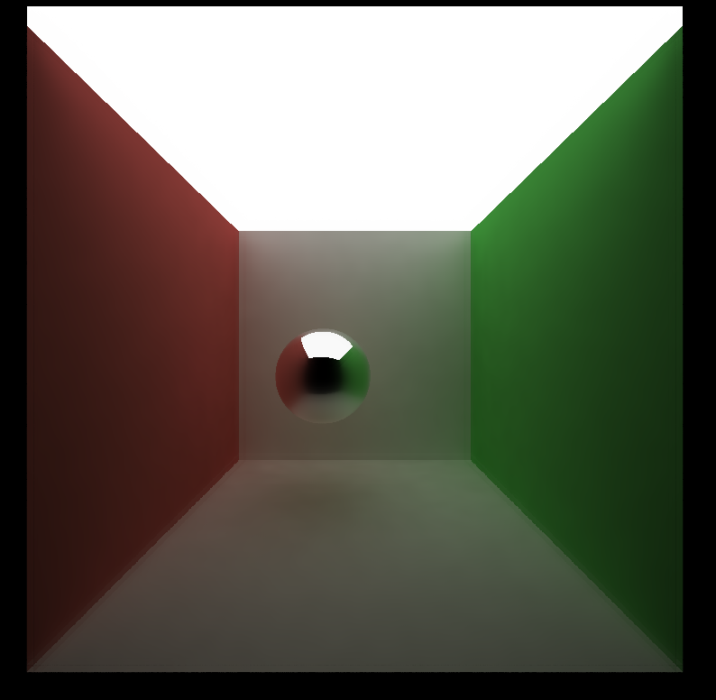
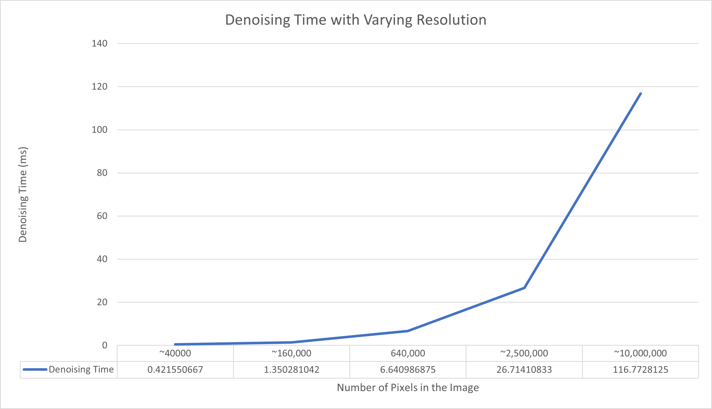
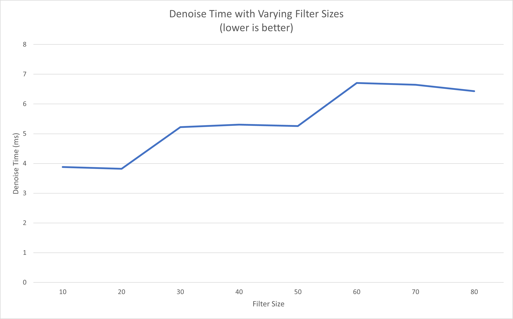
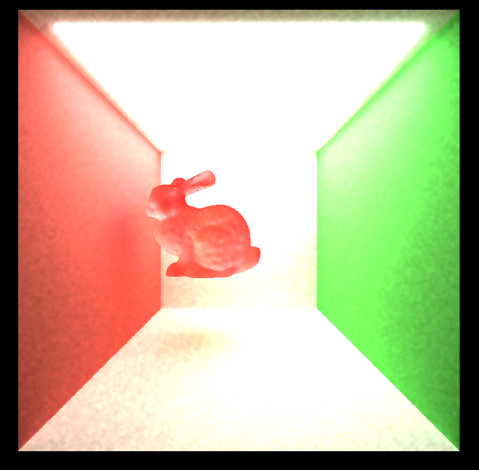
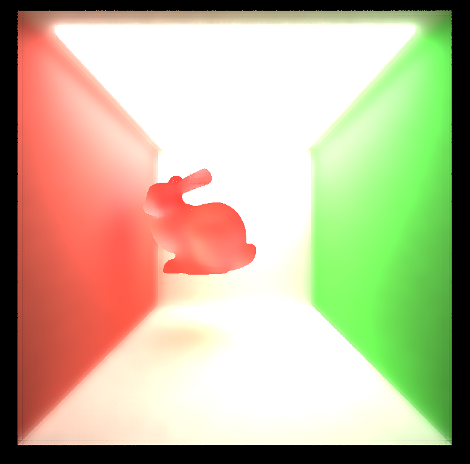
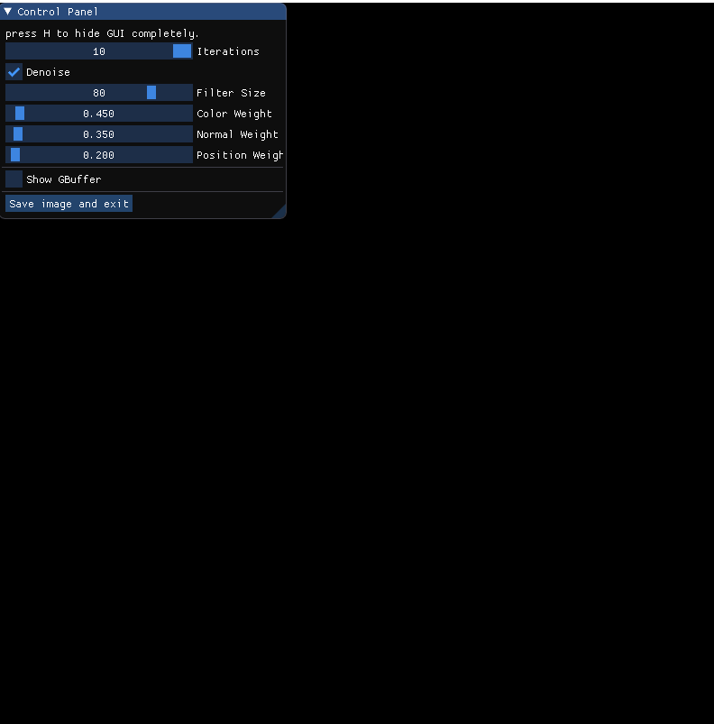
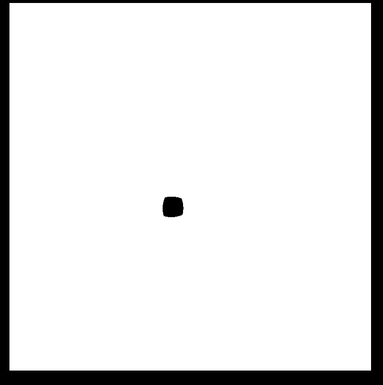

CUDA Denoiser For CUDA Path Tracer
==================================

**University of Pennsylvania, CIS 565: GPU Programming and Architecture, Project 4**

* Stephen Lee
  * [LinkedIn](https://www.linkedin.com/in/stephen-lee-bb5a40163/)
* Tested on: Windows 10, i7-9750H @2.60GHz, RTX 2060 6GB (personal laptop)
* 2 late days used for this project

# Project Overview
The goal of this project was to build off of [Project 3](https://github.com/StephenLee129/Project3-CUDA-Path-Tracer), which implemented a path tracer to render photorealistic scenes by using physically-based rendering techniques. While path tracing produces scenes which are more photorealistic than other rendering techniques such as rasterization, a few key drawbacks are that path tracing can be incredibly computationally expensive and can produce noisy scenes even when left running for a long time due to diminishing returns for computation spent. In this project a CUDA denoiser was implemented as a post-processor for path traced scenes to cut down on the amount of compute that has to be done to get nice looking renders.

Here's an example of a scene rendered for 100 path tracing iterations

And here's an example of the same scene rendered for 2000 path tracing iterations

Clearly the 2000 iteration example is much better, but it cost 20 times more compute to get it and it's still a little grainy. By applying the denoiser from this project we can transform the much cheaper 100 iteration render to make it look more like the 2000 iteration render without paying all the compute costs.

# Performance Analysis
### Cost of Denoising a Render
For the first part of my analysis, we examine the cost of running our denoiser on our renders. A total of 3 different scenes were analyzed for this section, where the time it took to path trace 100 iterations was measured, and then the denoiser was run with a filter size of 80 and a resolution of 800x800 to determine how much overhead it added to producing the final image.

In this first graph, only 2 out of the 3 scenes are shown for the sake of clarity:

It is clear that denoising had a minimal impact on the total time it took to produce the final scene. It only added a fairly constant amount of overhead of about 6-7ms to the overall render time. This overhead is made comically meaningless for scenes that are more computationally expensive in the path trace section.

We can see clearly see here that the time it takes to path trace the scene heavily dominates the amount of time it takes to denoise the scene. Since the Bunny scene took so much longer to path trace than the simpler scenes, the additional time added to denoise the scene is partically negligible.
### Iterations Need to Get a Smooth Image
Having shown that the denoiser hardly affects overall performance for rendering a scene, we now want to analyze how many iterations we can cut out and still get a smooth image by applying our denoiser. To test this, the Cornell Ceiling Light scene was used with an 800x800 resolution. 

For our baseline in this analysis a standard path traced render without denoising was done for 2000 iterations.

We can see that the image has rendered well and is pretty smooth overall with some small amounts of noise on the walls of the room. Compare this to the same scene rendered for only 100 iterations without denoising

Clearly the extra 1900 iterations removed a lot of noise from the side walls, and we can even see some noise in the reflective ball in the center of the room now. However when we apply our denoiser with a FilterSize of 88, a color weight of 0.309, a normal weight of 0.052, and a position weight of 0.103, we can see that the image is incredibly smooth now

When looking at the walls of the scene, they're even less noisy than the first 2000 iteration image. One downside is that the image gets slightly blurred when geometries meet. This can be attributed to the normal weights. Finer tuning of the normal weights may be able to get sharper edges between geometries while still denoising objects. The main issue in this scene is that if I decreased normal weights any more, the sphere in the center would get noisy since its surface is completely comprise of unique normals which weren't being weight heavily enough. However when normal weights were increased, the scene became a little blurred.
### Impact of Resolution
The next paramter that we want to analyze is image resolution. Since the path tracing algorithm shoots out a ray per pixel, we would expect this operation to take more time as resolution increases since more pixels will be in the scene, consequently making more rays to trace through the scene. Further since denoising similarly does per-pixel operatoins, we would expect denoising time to also increase with respect to pixel count.

We can see an exponential growth in both path tracing time (no denoising) in the first graph and denoising time in the second graph. Since we're scaling pixel count in the image exponentially as well, we can assert that this is a direct positive correlation between both the time it takes to path trace a scene and denoise a scene with respect to resolution. The first graph also further reinforces the findings from earlier where the cost of denoising hardly affects the overall image render time. Regardless of resolution, the first graph shows that No Denoising and With Denoising have virtually the same render times.
### Impact of Filter Size
Finally we test the impact of filter size on performance. Increasing filter size will increase the run time of denoising, because it increases the number of iterations needed to complete the A-Trous denoising algorithm that has been implemented. This number of iterations is discretized based on the `ceil(logbase2(filtersize))` so we would expect to see the time it takes to denoise the image increase in discrete steps with respect to filter size. For this section, we once again use the Cornell Ceiling Light test scene with a resolution of 800x800 to gather data.

We observe the phenomenon that was discussed having discrete step ups in compute time for denoising as filter size increased.

### How Filter Size Impacts Visuals
Since filter size impacts how wide of a range we are gather samples from we would expect larger filters to blur out finer local details. We can observe this when comparing two Bunny scenes where one on top has filter size of 16 and the other has a filter size of 58

The finer details of the bunny's surface get completely smoothed out when going from a size 16 filter to a size 58 filter. While the walls of the scene become much less noisy at size 58, we lose a lot of details in the scene that makes this filter size not too practical for denoising this particular scene.

### Denoising Effectiveness on Different Materials
Taking the example from earlier of a 100 path trace iteration render of Cornell Ceiling Light, we can compare the effectiveness on diffuse materials and reflective materials

We can see that the geometry of the diffuse materials on the walls get maintained much better than that of the reflective sphere in the center of the scene. This is especially prominent at the center of the sphere where it is reflecting light out of the front of box. The edges of the walls in the reflection with respect to the empty front panel of the box is pretty hazy here and the wall colors kind of just fade into the black box opening. While there is some blurring on the edges of the actual walls, there are still very pronounced.
### Scene Result Comparison
The biggest difference across scenes that I encountered were between the simple Cornell box scenes and the Bunny scene.

Both of these renders were done for 100 path trace iterations, but the bunny scene comes out a lot worse. This can largely be attributed to the fact that the process of denoising an image will inherently take away information from the image by smoothing out values. Since the Bunny scene has a much more complex surface texture than the Cornell scene, denoising was not only a lot more finicky with regards to paramter tuning, but also just less effective overall with respect to visual fidelity.

# Bloopers
A summary of a few of the issues that I encountered

At first, I was doing the denoise computations in the same buffer that the pathtrace computations were done in. When the max iterations was reached, pathtracing stopped producing new data, and my denoising algorithm slowly made all the colors approach 0 leading to a black screen.

In my first attempt to solve the issue from the previous blooper, I forgot to normalize the data I was copying over based on iteration number. The accumulated values would all flow past 1 leading to the entire screen except for the part that was black for all iterations to become white.

Here I accidentally added each of the weight contributations together rather than multiplying them. This caused the weight to be much bigger than it should have been leading to a very blurry scene.