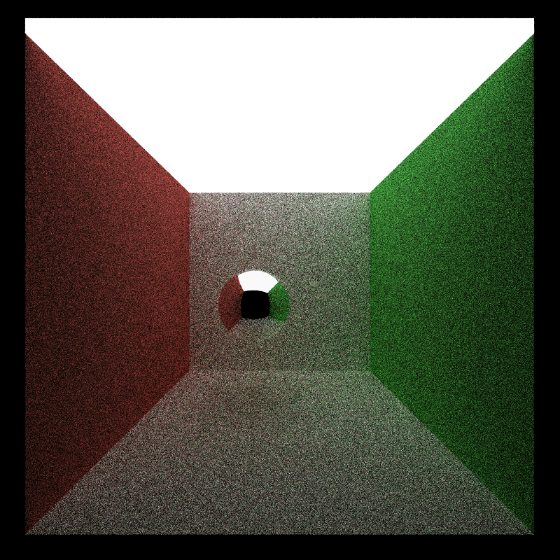
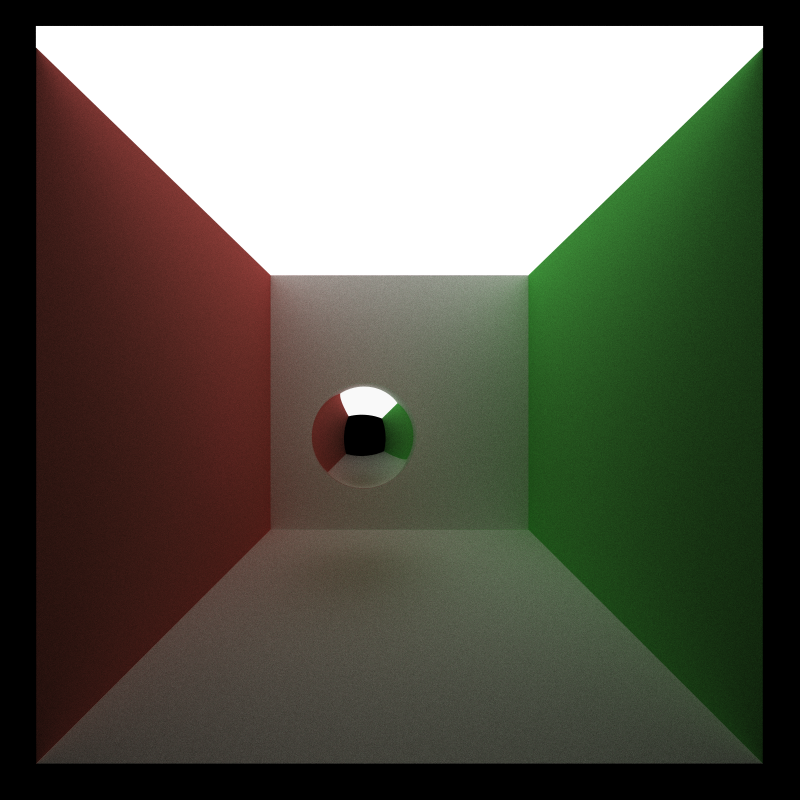
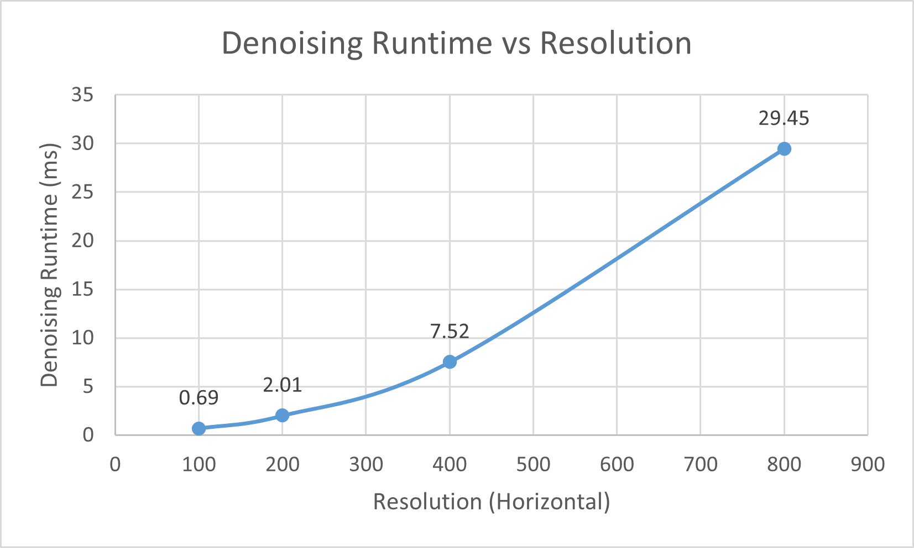
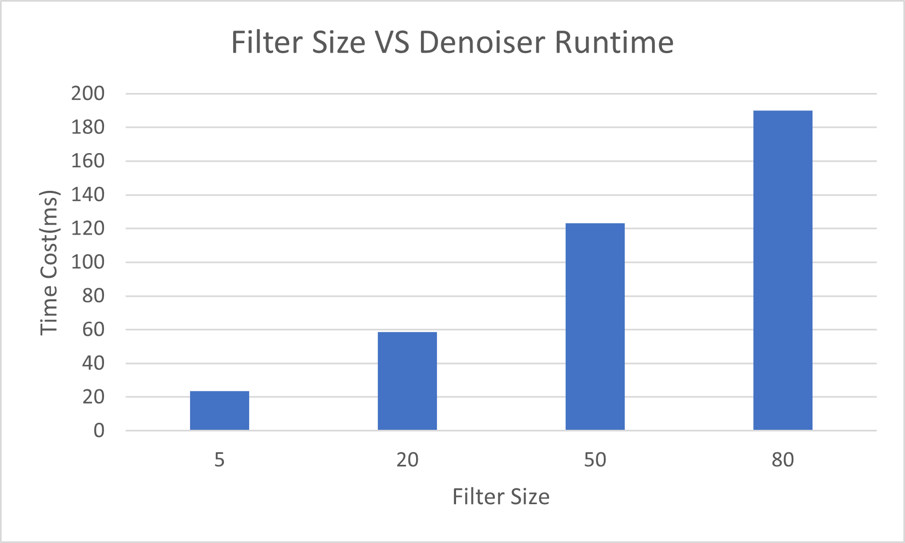
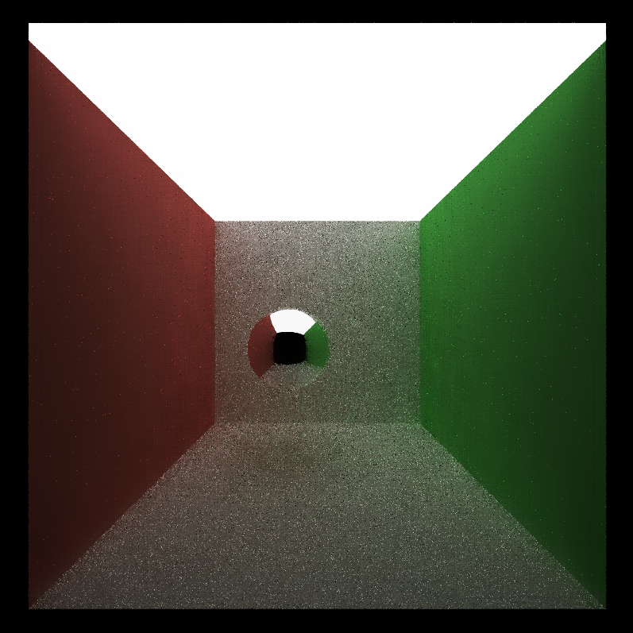
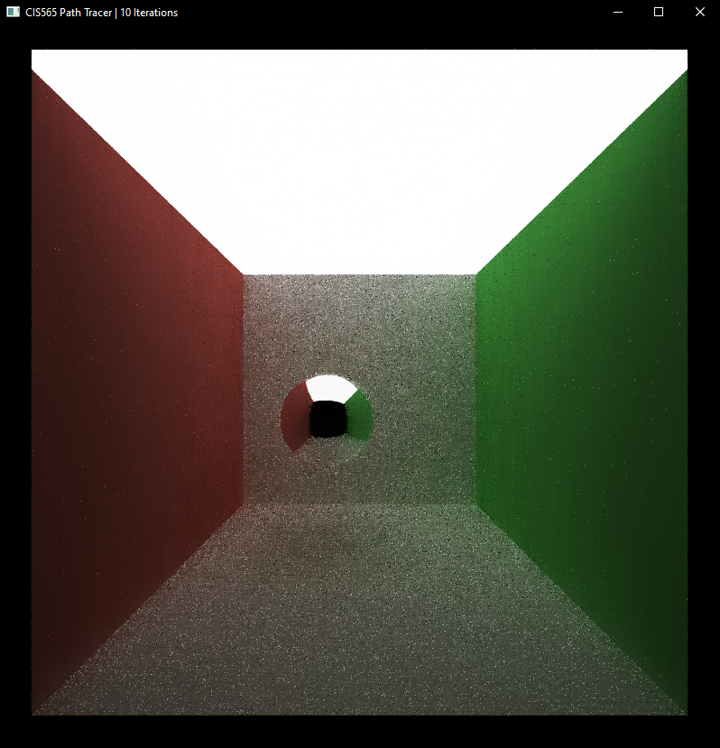
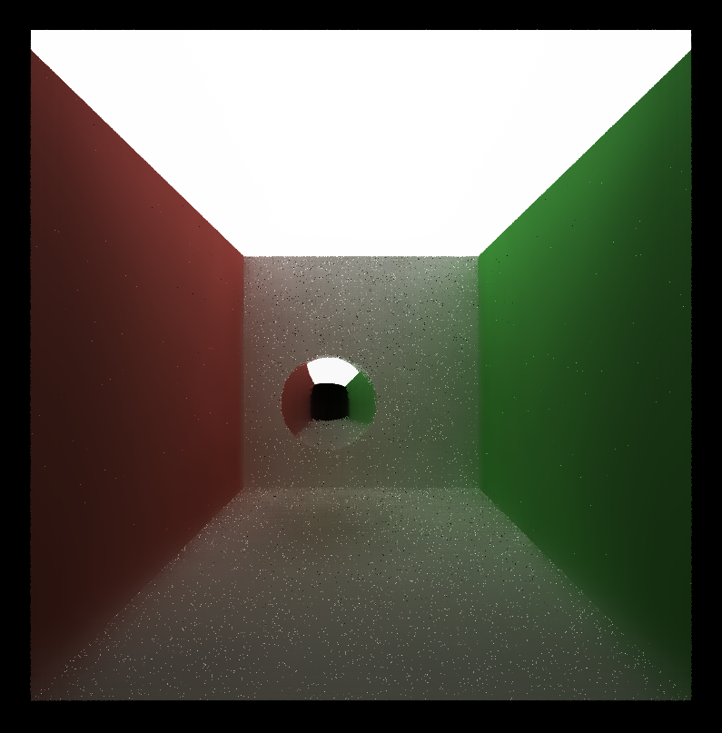
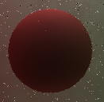
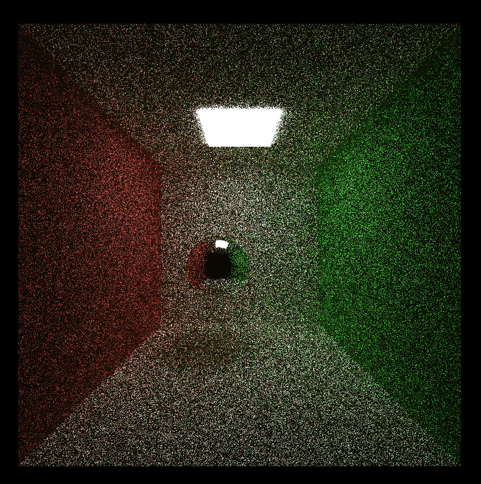

CUDA Path Tracer
================

**University of Pennsylvania, CIS 565: GPU Programming and Architecture, Project 3**

* Yichao Wang
  * [LinkedIn](https://www.linkedin.com/in/wangyic/) 
* Tested on: Windows 10 Home 64-bit (10.0, Build 18363)
  * Intel(R) Core(TM) i7-7700HQ CPU @ 2.80GHz (8 CPUs)
  * GeForce GTX 1060	6.1

## Decription

This project is an extension for the [path tracer project](https://github.com/YichaoW/Project3-CUDA-Path-Tracer). The denoiser is implemented using [Edge-Avoiding À-Trous Wavelet Transform](https://jo.dreggn.org/home/2010_atrous.pdf) to reduce the noise in the path tracer so that it can converge faster.

## Performance Analysis

### Denoiser Visual Comparison
|Without Denoiser (10 iterations) | With Denoiser (10 iterations) |
|--|--|
|||

*Denoiser parameter: filter size = 80, color weight = 3.145, normal weight = 0.350, position weight = 0.200 (all the other images are rendered using this configuration unless otherwise stated)

From above comparison, we can see denoiser provides a better image with only an additional run time cost of 190ms.

|Without Denoiser (1000 iterations) | With Denoiser (10 iterations) |
|--|--|
|||

Without the denoiser, a path tracer requires about 1000 iterations to achieve the similar result. However, it cost about 34027ms to render the left image but only 575ms to render the right image.

### Resolution VS Denoiser Runtime

From above plot, we can see that the runtime increases as the resolution increases. This is because we have more pixel to compute and we can compute more filter size (stepwidth can be larger) for each pixel.

### Filter Size VS Denoiser Runtime

From above plot, we can see that the runtime increases as the filter size increases. This is because we need to compute more stepwidth for each pixel.

### Filter Size Visual Results

|Filter Size = 5 | Filter Size = 20 |
|--|--|
|||

|Filter Size = 50 | Filter Size = 80 |
|--|--|
|||

We can see that the image converges better as filter size increases in general. However, although filter size 20 cost more time, there are not much difference between filter size 5 and 20.

### Material VS Denoiser

|Diffuse | Reflect|
|--|--|
|||

From above images, it seems denoiser works better with diffuse materials since reflect materials may reflect noises from other surface.

### Scenes VS Denoiser

|Smaller Light | Bigger Light|
|--|--|
|||

With same configuration, we can see that denoiser does not work well for small light scene. This is because the chance to hit the smaller light is smaller so that there are too much noise.
