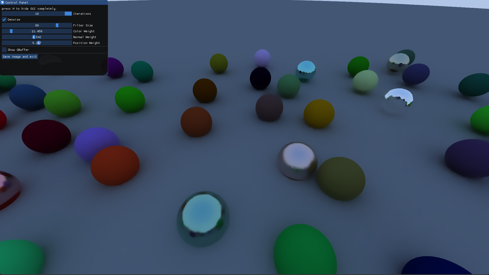
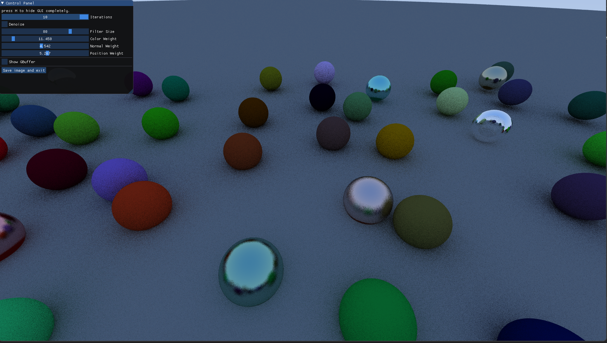
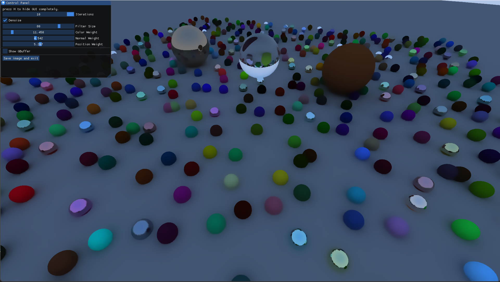

CUDA Denoiser For CUDA Path Tracer
==================================

**University of Pennsylvania, CIS 565: GPU Programming and Architecture, Project 4**

* (Charles) Zixin Zhang
* Tested on: Windows 11, 11th Core i7, 3060 Laptop GPU

# Results

Figure 1: Zoomed-in "So many balls" Scene: 

Denoised: 

Noised: 

---

Figure 2: "So many balls" Scene:

Denoised: 

Noised: 

---

Figure 3: A Simple Cornell Box:  

This denoiser is achieved by implementing the paper "Edge-Avoiding A-Trous Wavelet Transform for fast Global Illumination Filtering," by Dammertz, Sewtz, Hanika, and Lensch. 

# Performance Analysis

 In my implementation, denoising is performed during the last iteration. We perform 10 iterations on the ray traced images and the 11th iteration is the denoising step. 

## Denoising Performance

|             | How much time does denoising take in ms? |
| ----------- | ----------- |
| Figure 1      | 52       |
| Figure 2   | 43        |
| Figure 3   | 44        |

Since we apply denoising once, this technique is very efficient at eliminating noise in the scene. 

## Comparison with Pure Ray Traced Images

|             | How many iterations do ray traced images need to achieve a smooth result? |
| ----------- | ----------- |
| Figure 1      | ~1000     | 
| Figure 2   | ~5000        | 
| Figure 3   | ~5000        | 

As shown in the table, if we took more samples per pixel to eliminate the noise, it would take more iterations and time to achieve a similar result. 

## Resolution

Denoising took a significant amount of extra time when the resolution went from 1080p to 4k. It is expected since our run time depends linearly on the pixel count in the scene. 

|             | 720p | 1080p | 4K |
| ----------- | ----------- | ----------- | ----------- |
| Figure 1      | 10ms  |             ~52ms         |  120ms     |
| Figure 2   |   ~16ms   |        ~43ms        |~215ms|
| Figure 3   |  ~17ms    |        ~44ms        |~215ms|

# Changes 

In order to programmatically generate a lot of balls (121 balls in figure 1 and 2), scene files are only used to specify the camera specifications. All geometric shapes and materials are specified at run time in the actual code. 

Fuzziness is added to the material properties such as we can have [fuzzy reflection](https://raytracing.github.io/books/RayTracingInOneWeekend.html#metal/fuzzyreflection). 

# Future Plan

I want to continue to apply what I learn in [_Ray Tracing in One Weekend Series_](https://raytracing.github.io/books/RayTracingInOneWeekend.html) and make it work with the current CUDA framework. 

# References

- [_Ray Tracing in One Weekend Series by Peter Shirley_](https://raytracing.github.io/books/RayTracingInOneWeekend.html)
- [_Edge-Avoiding A-Trous Wavelet Transform for fast Global Illumination Filtering by Dammertz, Sewtz, Hanika, and Lensch_](https://jo.dreggn.org/home/2010_atrous.pdf)
- [_Accelerated Ray Tracing in One Weekend in CUDA by Roger Allen_](https://developer.nvidia.com/blog/accelerated-ray-tracing-cuda/)
- [_CUDA Denoiser by Janine Liu_](https://github.com/j9liu/Project4-CUDA-Denoiser)
- [_CUDA Pathtracing Denoiser by Jilin Liu_](https://github.com/Songsong97/Project4-CUDA-Denoiser)

