# CUDA Denoiser 

**University of Pennsylvania, CIS 565: GPU Programming and Architecture, Project 4**

* **Name:**  Beini Gu
  * [LinkedIn](https://www.linkedin.com/in/rgu/), [personal website](https://www.seas.upenn.edu/~gubeini/), [twitter](https://twitter.com/scoutydren), etc.
* Tested on: Windows 10, AMD Ryzen 7 3700X 8-Core Processor 3.59 GHz 16GB, GTX 2060

## Project Description

This is a CUDA-based denoiser for path tracing. The denoising algorithm in use the Edge Avoiding A-Trous Wavelet Transform. This denoiser reduces the number of iteration steps for the Monte Carlo sampling path tracer. I integrated the denoiser into the previous CUDA path tracer project with added GUI sliders and parameters with the Dear Imgui library. 

## Denoising Effects

* Cornell ceiling light demo

| Denoising On       | Denoising Off       |
| ------------------ | ------------------- |
|  | 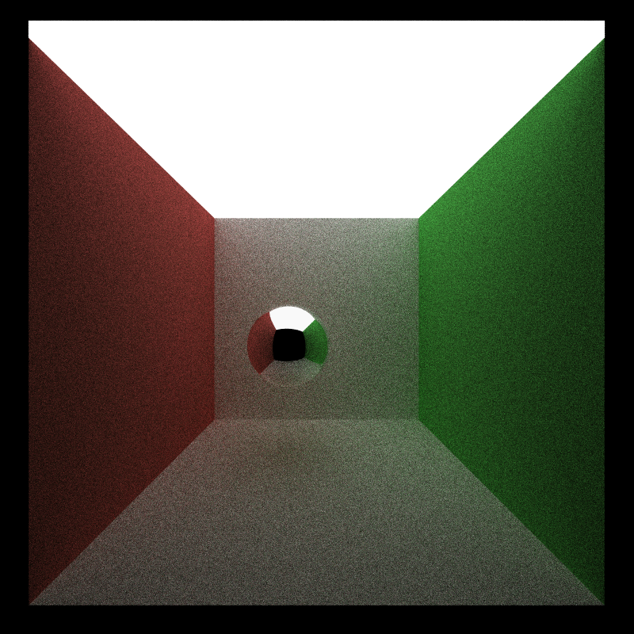 |

* G buffers (custom scene demo)

| Normal Buffer                | Position Buffer            |
| ---------------------------- | -------------------------- |
| 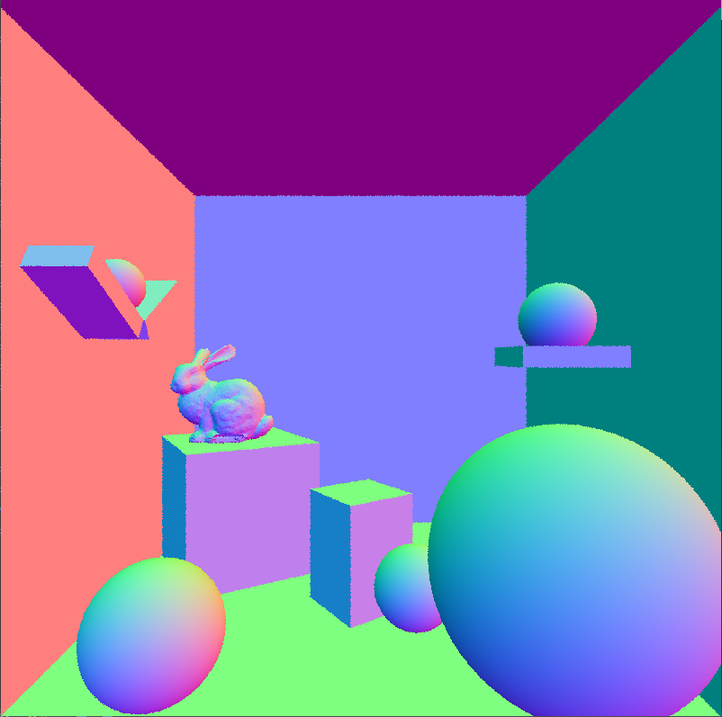 | 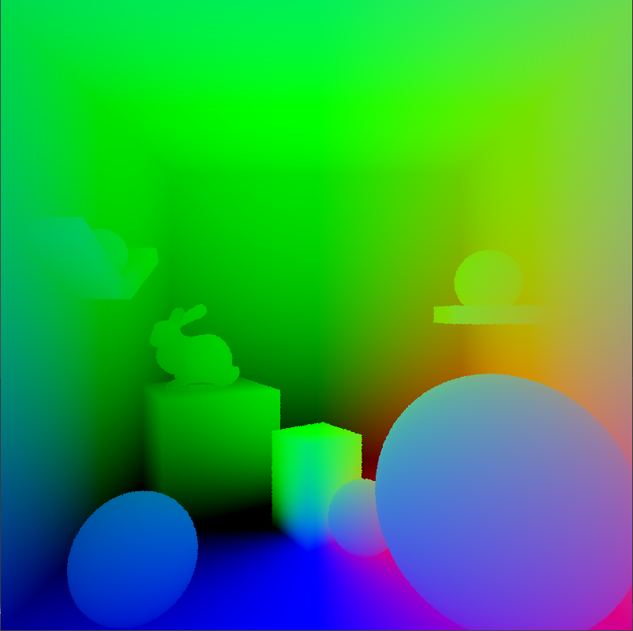 |

## Performance Analysis

### Time taken w/w.o. denoising

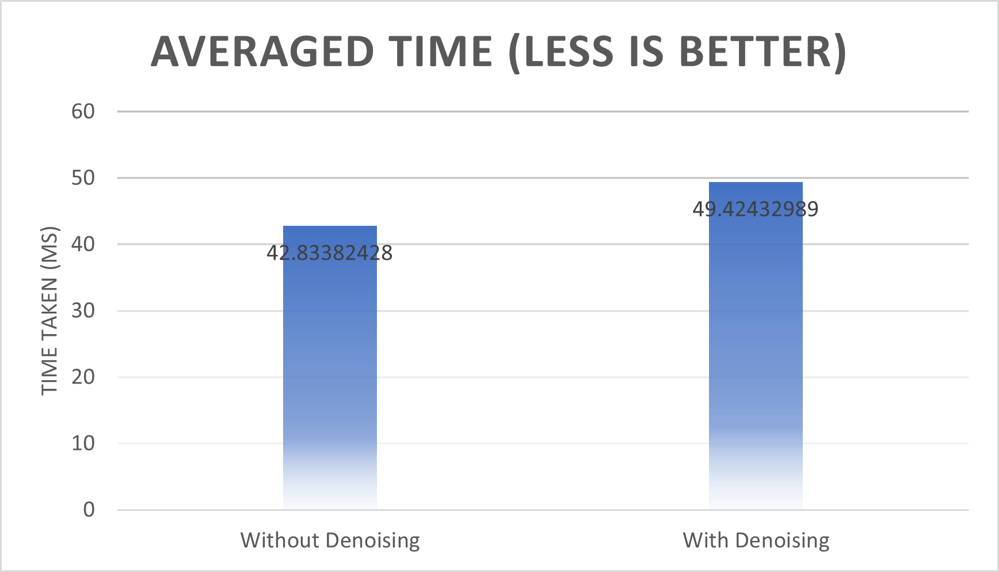

* The conclusion for this is the denoising does not add significant overhead to the rendering. Adding denoising adds 15% of the original time. The performance difference between rendering with denoising and rendering without denoising is almost negligible. 

### Number of iterations taken for image to be "smooth"

| With Denoising                                      | Without Denoising                                    |
| --------------------------------------------------- | ---------------------------------------------------- |
| 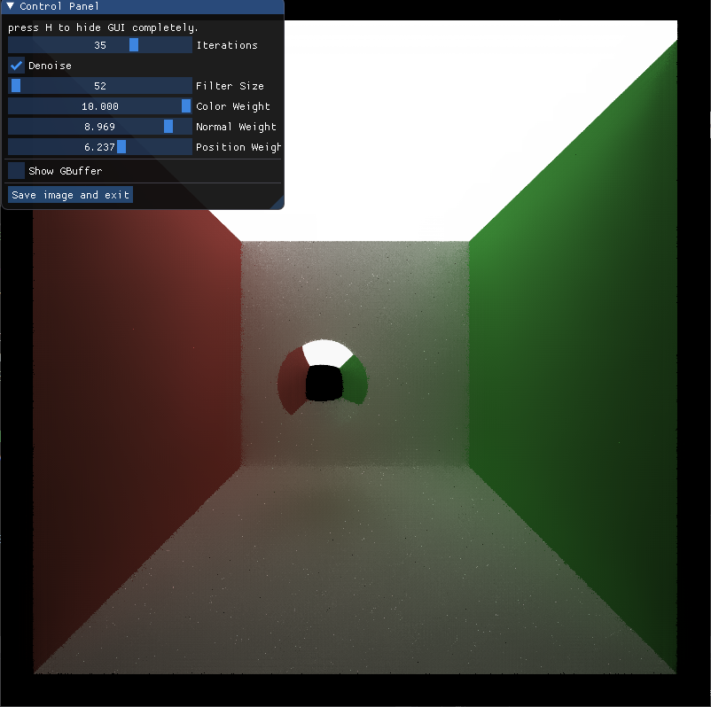 | 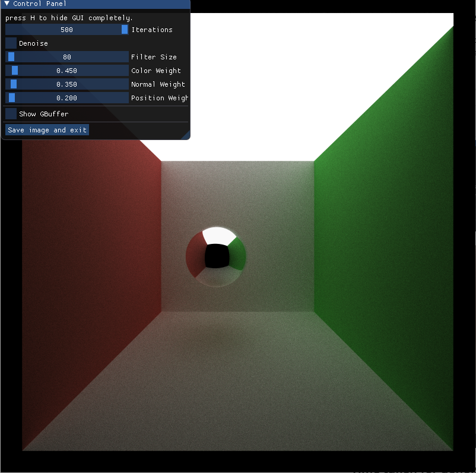 |

* The left image: With added denoising, the image looks smooth when it only has 35 iterations. However, on the right image, without added denoising, the image needs 500 iterations to look "smooth" enough.

### Time taken for denoising with increasing resolution

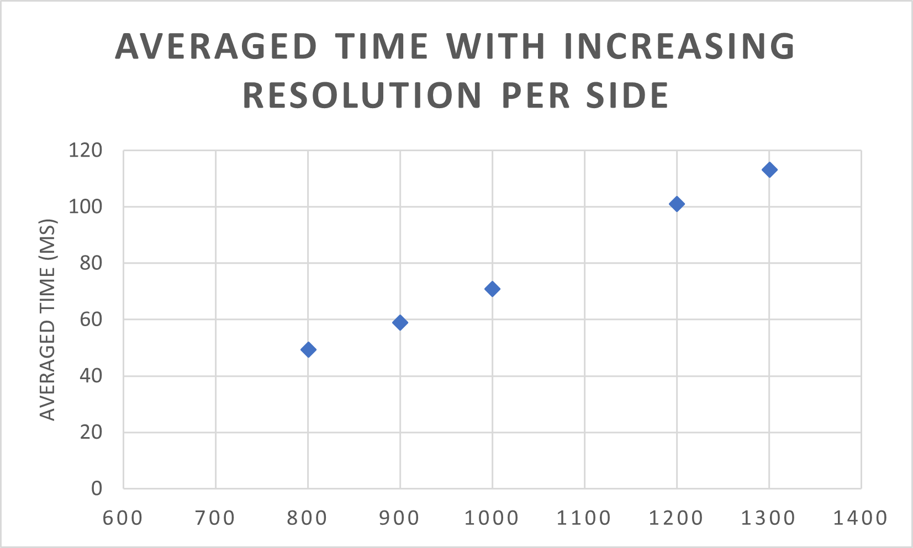

* The time taken for denoised rendering increases linearly as resolution increases. 

### Time taken for denoising with increasing filter size

```c++
    int atrou_iter = glm::floor(log2((filtersize - 5) / 4.f)) + 1;
```

* The number of iterations that the A-trous denoising kernel is calculated as above using filterSize. The below illustration shows why it's calculated this way by taking the integer log2 of (filtersize - 5) / 4  plus 1. 

  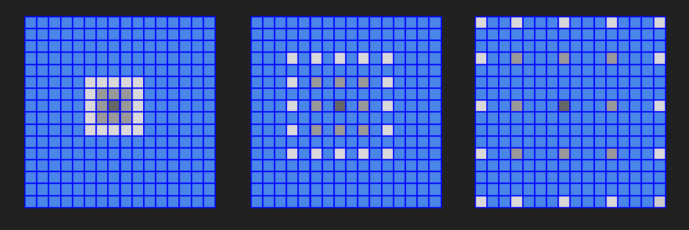

* The time increases with increasing filter size, but not in a linear pattern. Simply because the  time increases along with the iterations, not with the filtersize. And filtersize increase results in Log(n) increase for the number of iterations. It is shown in the below graph. 


### Image Quality with increasing filter size

* For a image resolution with 800 * 800

| FilterSize = 20          | FilterSize = 100          | FilterSize = 200           |
| ------------------------ | ------------------------- | -------------------------- |
|  |  | 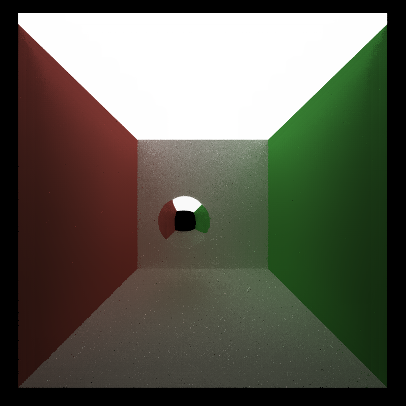 |

* **Small filter size: ** resulting in worley-looking noises in the image 
* **Medium filter size: ** works best
* **Big filter size: ** smoothing too much, in the rightmost image where filtersize = 200. The shadow casted is much smaller compared to the middle because it gets smoothed out. 

### Material Type comparison

| Perfectly Specular       | Refractive material (glass) |
| ------------------------ | --------------------------- |
| 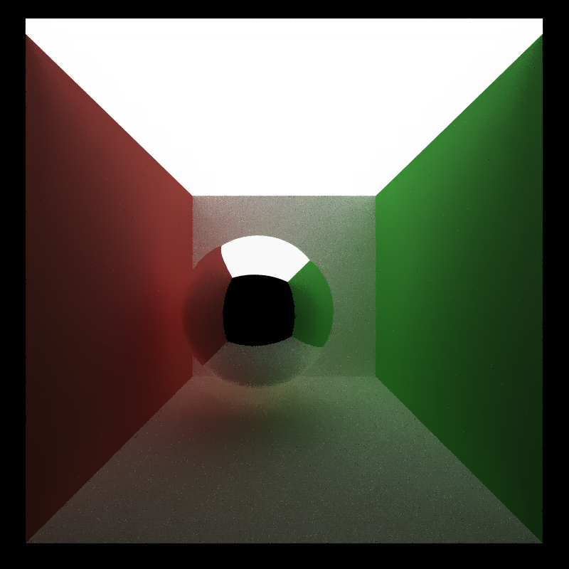 | 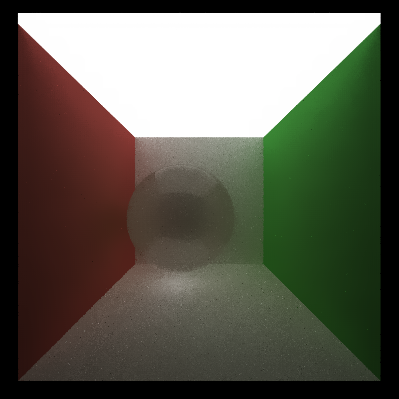     |

* The left image shows a perfectly specular sphere after denoising. This is a good result since it perserves  the quality of the material
* The right image shows the refractive glass material, but it is not smoothed out nicely. It loses some quality of the refractive material. 
* For perfectly diffuse materials, it works the most nicely (On the walls)

CUDA Path Tracer
================

**University of Pennsylvania, CIS 565: GPU Programming and Architecture, Project 3**

* **Name:**  Beini Gu
* [LinkedIn](https://www.linkedin.com/in/rgu/), [personal website](https://www.seas.upenn.edu/~gubeini/), [twitter](https://twitter.com/scoutydren), etc.
* Tested on: Windows 10, AMD Ryzen 7 3700X 8-Core Processor 3.59 GHz 16GB, GTX 2060

## Project Description

This is a CUDA-based path tracer with global illumination able to render scenes utilizing the parallel computing power of GPU. 


## Table of Contents

[Features Overview](#overview-features)   
[Miscellaneous](#misc)   
[Performance Analysis](#performance-analysis)   
[Bloopers](#bloopers)

[Reference](#Reference)

<a name="overview-features"/> 

## Features Overview

#### Obj Mesh Loading

I use the [tinyObj](https://github.com/tinyobjloader/tinyobjloader) library for parsing and loading the custom triangulated meshes in obj format. Using the VBO data to get the position of the triangle vertices, calculate the normals and calculate their intersections with rays. 

To optimize performance and reduce number of ray-triangle intersection tests, I use a bounding box for the mesh which first checks if the ray hits anywhere inside the bounding box volume in order to reduce unnecessary rays which intersects somewhere outside the bounding box. 


| Bunny                   | Cow                 |
| ----------------------- | ------------------- |
|  |  |

#### Refraction

I implement refractive materials using Schlick's approximation and Snell's Law. This is how it looks

* Glass caustics on the floor (IOR = 1.52)


#### Depth of Field

I implement a togglable depth of field effect which simulates a realistic camera with focal distance and lens radius. 

| Without Depth of Field    | With Depth of Field (Focal distance = 10.0) | With Depth of Field (Focal Distance = 5.0) |
| ------------------------- | ------------------------------------------- | ------------------------------------------ |
|  |                    |                    |

#### Anti-aliasing

| Without Anti-Aliasing                    | With Anti-Aliasing                         |
| ---------------------------------------- | ------------------------------------------ |
|  |  |

#### Stratified and Halton Sampling

I implemented two other hemisphere sampling methods: stratified and Halton sampling. Under larger numbers of iterations, there won't be a lot of difference. 

| Random Sampling (iters = 20) | Stratified Sampling (iters = 20) | Halton Sampling (iters = 20) |
| ---------------------------- | -------------------------------- | ---------------------------- |
|     |     |     |

Halton sampling is quasi-random number generation, it leaves a pattern on the render when sample number is small. (The above image of Halton Sampling uses 1000 as the sample number, while stratified sampling uses 100 as the sample number. )

| Halton (Sequence length = 100) | Halton (Sequence length = 500) | Halton (Sequence length = 1000) |
| ------------------------------ | ------------------------------ | ------------------------------- |
|   |   |   |

<a name="misc"/> 

## Miscellaneous

I implemented material sort using thrust to improve the performance of path tracer. In addition, there is a togglable option for caching the first intersections (does not work together with anti-aliasing). 

<a name="performance-analysis"/> 
## Performance Analysis

#### Mesh Culling

Applying mesh culling gives a performance advantage compared to no bounding volume checks. 

The following performance is tested rendering for the profile main scene. It's a 1.6 times performance increase. 


For the mesh only scene of the bunny render, the performance is also measured. We can see the advantage is less significant. Since in the previous render, the rabbit is smaller in the entire render, using a bounding box to bound that smaller region gives much more advantage. 


<a name="blooper"/> 

## Bloopers

| Normal Error & Distance calculation error                    | Refraction calculation error                                 | Randomness error                                             |
| ------------------------------------------------------------ | ------------------------------------------------------------ | ------------------------------------------------------------ |
|  |  |  |

## Reference

* PBRT book [Physically Based Rendering: From Theory to Practice](https://www.pbr-book.org/3ed-2018/contents)
* en.wikipedia.org/wiki/Halton_sequence

