CUDA Denoiser For CUDA Path Tracer
================

**University of Pennsylvania, CIS 565: GPU Programming and Architecture, Project 4**

* Aditya Hota
  * [LinkedIn](https://www.linkedin.com/in/aditya-hota)
* Tested on: Windows 11, i7-8750H @ 2.20 GHz 20 GB, GTX 1070 8 GB

# Overview
| Baseline (5000 iterations) | Smoothened with À-Trous (500 iterations) |
| ---------- | ---------- |
|  |  |

This project involved implementing a the A-Trous wavelet filtering algorithm into our CUDA path tracers. Because path tracers randomly shoot a ray into the scene per pixel, the images can be rather noisy. Adding denoising helps; however, we cannot simply blur the image to hide the noise. We must instead account for the positions and edges of objects and instead selectively blur parts of the image. That is what the A-Trous algorithm seeks to accomplish.

## Features
* A-Trous filtering on demand per iteration
* Visualization of geometry buffers (G-buffers) used in A-Trous algorithm

# Performance analysis
## Denoising Runtime
The graph below shows how rendering runtime is impacted by the denoising algorithm. For three different scenes, the amount of time taken to render 100 iterations was measured. As can be seen, there is only a slight increase in render time when denoising is added--and this is with denoising being performed after each iterations. Experimental data was collected with filter size 65 and 800x800 resolution as constants.

  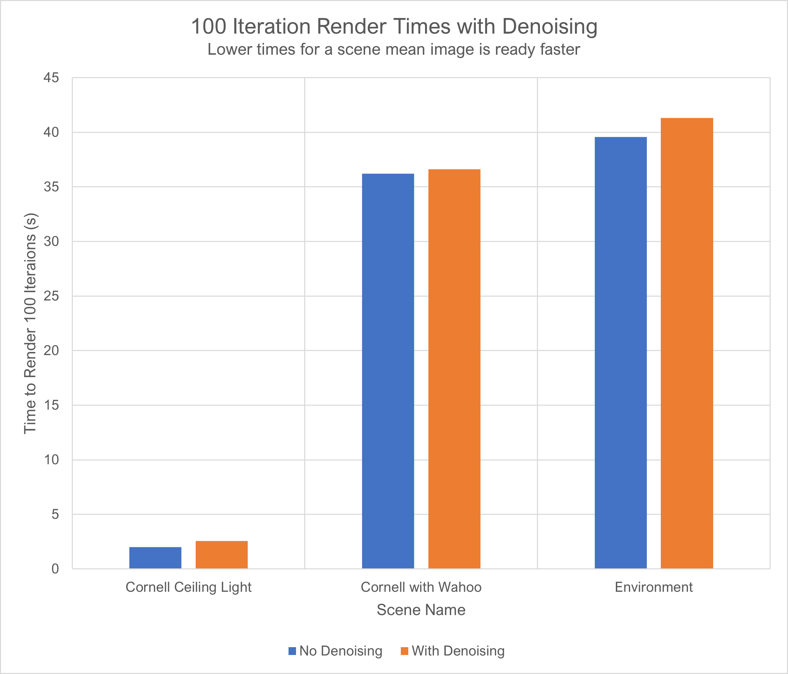

The rendering time difference values are presented in the following chart:

| Cornell Ceiling Light | Cornell with Wahoo | Environment |
| ---------- | ---------- | ---------- |
| 543.89 ms | 379.46 ms | 1735.07 ms |

In the case of the most complex scene (Environment), it took only about 1.7 more seconds to process all 100 denoising iterations. This is before the fact that denoising will decrease the total number of iterations required to obtain a smooth image. Therefore, we can confidently say that denoising is beneficial, and that lower number of required iterations outweighs the additional runtime per itration.

## Iterations Required for Smooth Images
The denoiser helps immensely with smoothing noisy images. Though it is impossible to get a perfect 1:1 recreation of an image using denoising, we can elimiate much of the "particle effect." In the samples below, `F` is the filter size, `c` is the color weight, `n` is the normal weight, and `p` is the position weight.

The first test is with the Cornell Ceiling Light scene. This loads in a reflective sphere in a room with the ceiling being completely lit. This allows iterations of the path tracer to run very quickly. Because there are no complex geometries, we can get an image that smoothens out the noise on the walls and floor, but at 200 iterations we can still see noise on the reflection of the ball. This is because the denoiser does not know about surface normals on reflected surfaces, so the color on the ball is smoothened out. With 500 iterations, we can reduce the position and color weights, leading to less blurring of the ball surface; this better preserves the edges. Because our 1000 iteration baseline image was blurry and with 200 iterations we obtain an even smoother image, our optimization is >80%.
| Baseline (1000 iterations) | `F`=129, `c`=0.205, `n`=0.020, `p`=1.514m, iter=50 | `F`=65, `c`=0.122, `n`=0.020, `p`=0.437, iter=200 |
| ---------- | ---------- | ---------- |
| 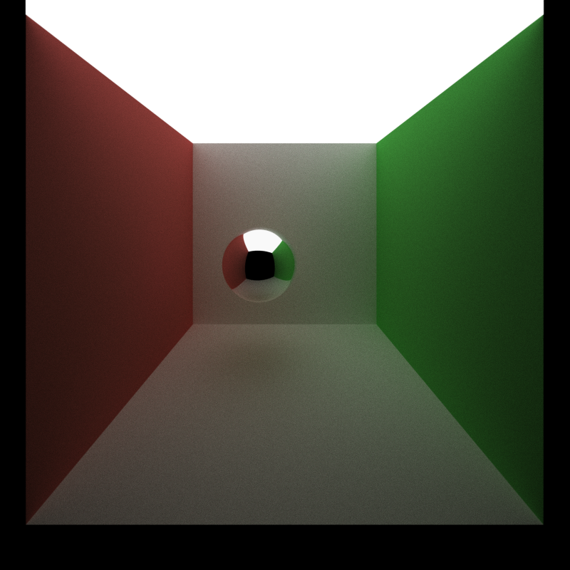 | 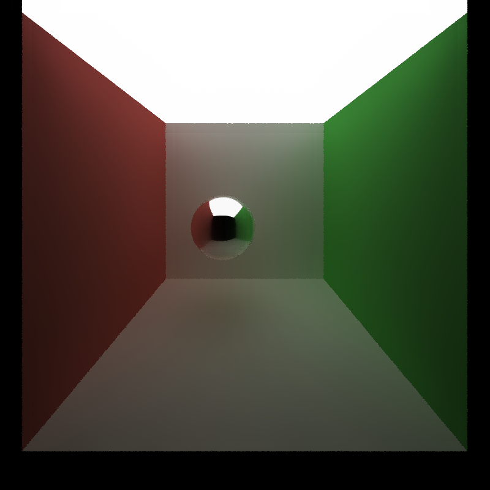 | 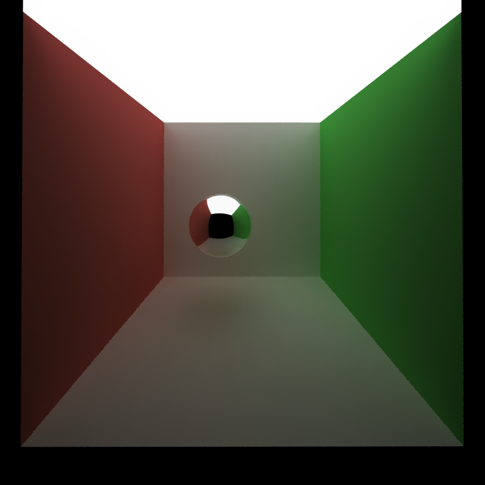 |

My next test is using the Cornell with Wahoo scene. This loads in a mesh with many triangles and a glass ball is placed close to the camera. There is also a reflective cube and sphere. Even with just 500 iterations, we get an image that is smoother than the 5000 iteration baseline image. At 200 iterations, we need to keep the filter size small to prevent losing too many details on reflected and refracted rays. However, we see that there is a loss of details on the reflective and refractive surfaces--on the ball, the edges between the walls are less pronounced and through the sphere, the Mario is blurrier.  We achieve an optimization of >90%.
| Baseline (5000 iterations) | `F`=65, `c`=0.285, `n`=0.030, `p`=0.213m, iter=206 | `F`=65, `c`=0.138, `n`=0.030, `p`=0.262, iter=500 |
| ---------- | ---------- | ---------- |
|  | 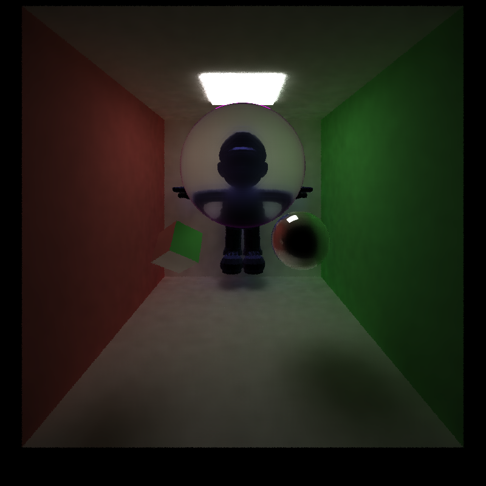 |  |

## Impact of Resolution
Image resolution has a major impact on the rumtime of the render, for both the path tracing and denoising kernels. Path tracing takes longer because there are more rays that need to be shot from the camera into the scene, so its positive correlation with resolution is expected.

Denoising also takes longer because there are more pixels to denoise. The current denoising algorithm computes a convolution for each image pixel, before weighting the convolution by the proximity to an edge. The first graph below shows how the total rendering time for 100 iterations increases with resolution. The second graph shows how much time denoising adds at each resolution. Experimental data was collected with filter size 65 as a constant, in the Cornell with Wahoo scene.

| Runtime of Complete Workflow | Runtime of Denoiser |
| ---------- | ---------- |
| 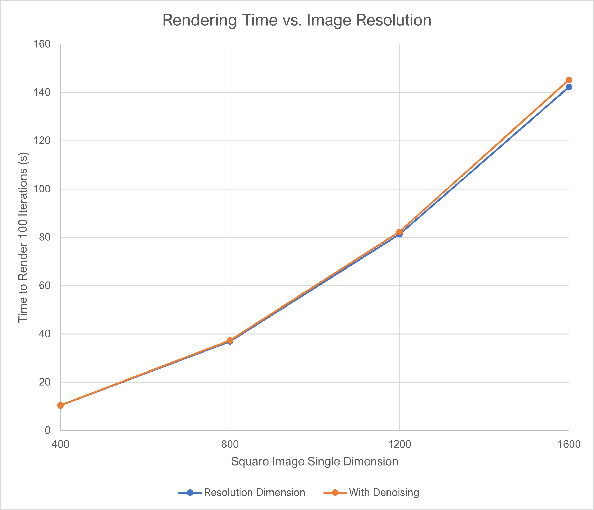 | 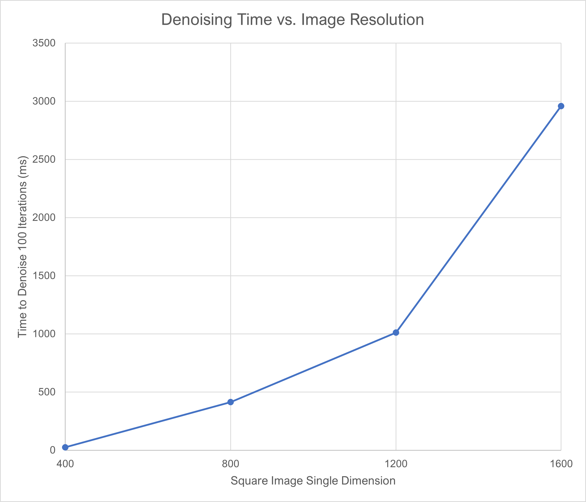 |

The time taken to denoise grows exponentially, which makes sense because the number of pixels in the image grows exponentially too.

## A-Trous Filter Size
The impact of varying the filter size was also measured. This is important because depending on the scene, increasing the filter size will allow low-frequency scenes to be rendered with fewer iterations. If there are fewer color variations from pixel to pixel, it is advantageous to use a larger filter size so more blurring can occur over an area. This reduces the need for a less noisy starting image.

Having a larger filter means that the more A-Trous iterations will be needed. In my implementation, I take the `logbase2` of the filter size as the number of iterations, and scale the Gaussian filter width by 2 to the power of the iteration number. Therefore, it is expected that the rendering time will increase as the filter size increases. The results of this testing are shown below. Experimental data was collected with 800 x 800 resolution as a constant, in the Cornell with Wahoo scene.

  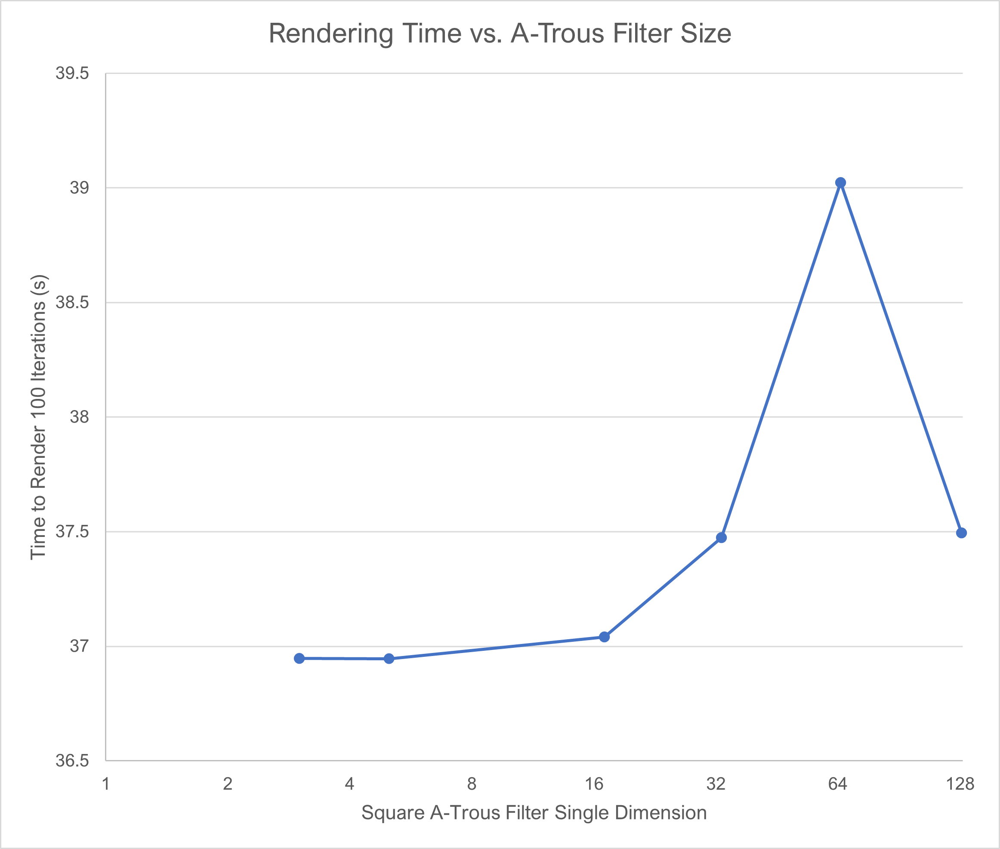

There appears to be an exponential increase in denoising time as the filter size increases, which is expected because the number of iterations of A-Trous increases exponentially with filter size. However, there is not a very large increase in runtime between a size of 5x5, 17x17 and 33x33, so somewhere in this range might be the "sweet spot." Unexpectedly, there is a drop in denoising time when a filter size of 128 is used. I am not sure why this is the case, since the same number and size of kernels--and therefore warps--are launched over the A-Trous iterations. My best guess is that memory reads are being coalesced better when reading from neighbors, leading to better access times from global memory.

## Visual Impact of Filter Size
When geometries are simple, like in the Cornell Ceiling Light, increasing the filter size helps reduce noise to an extent, and any further increases do not have a perceptible impact. Therefore, it is not necessarily better to keep increasing the filter size, as we can take advantage of the slightly reduced runtime of a smaller filter. With filter size 33, we can see the local regions of blurring, leaving many small circles on diffuse surfaces. With filter size 65 and above, these artifacts are gone and we don't see any difference as we increase the size further.
| `F`=33, `c`=0.122, `n`=0.020, `p`=0.437, iter=200 | `F`=65, `c`=0.122, `n`=0.020, `p`=0.437, iter=200 | `F`=129, `c`=0.122, `n`=0.020, `p`=0.437, iter=200 |
| ---------- | ---------- | ---------- |
| 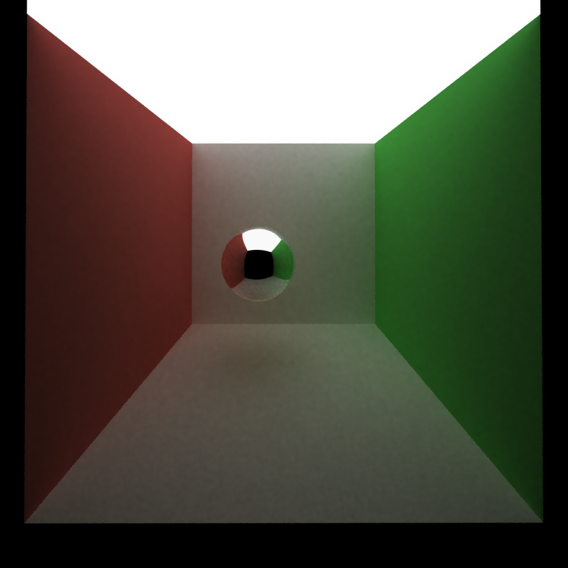 |  |  |

In the Cornell with Wahoo scene, we see negative impacts of having too large of a filter. With a filter size of 33, we see the same local blurred circle regions but with a size of 65, we no longer see these circles despite maintaining details in the image. However, once increasing the filter size to 129, we lose details in the circle: Mario's chest looks completely shadowed and the reflectivity at the edge of the pink circle is less prominent. Here, increasing the filter size had a negative impact, compared to no impact in the previous example.
| `F`=33, `c`=0.138, `n`=0.030, `p`=0.262, iter=500 | `F`=65, `c`=0.138, `n`=0.030, `p`=0.262, iter=500 | `F`=129, `c`=0.138, `n`=0.030, `p`=0.262, iter=500 |
| ---------- | ---------- | ---------- |
|  |  | 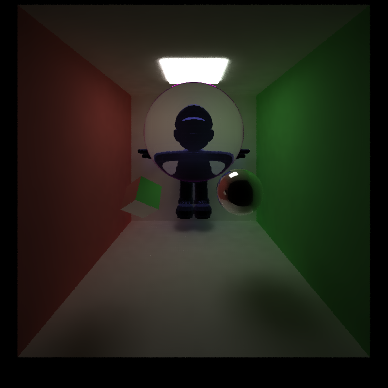 |

## Effectiveness on Various Materials
There are three types of material supported in this project: diffuse, specular, and refractive. Diffuse materials are handled the best, because they do not have to reflect as many rays. Since blurring does not take into account the geometric surface properties of the previous bounce, the filter tends to undesirably blur out reflective and refractive material surfaces.

### Diffuse
Diffuse materials are handled well. As can be seen in the image on the left below with no smoothing, there is still a lot of noise after 1000 iterations. But on the right, with just 200 iterations, the walls look completely smoothened out with no noise at all. The only drawback is that edges look aliased. Images are from the Cornell Ceiling Light scene.
| Baseline (1000 iterations) | `F`=65, `c`=0.122, `n`=0.020, `p`=0.437, iter=200 |
| ---------- | ---------- |
| 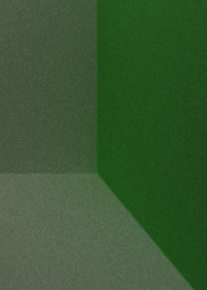 | 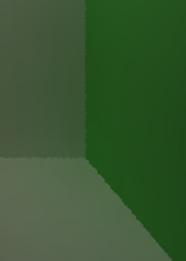 |

### Reflective
Reflective materials are handled okay but need higher numbers of iterations to preserve the image. When a ray from a diffuse surface reflects off the reflective surface, we cannot simply perform A-Trous on the reflective surface since we have no knowledge of the surface geometry of where the ray came from. The images below show the Cornell with Wahoo scene, in which the diffuse wall is smoothened very well but the specular surface of the reflective ball is rough. There is some smoothening compared to the original image, but increasing the filter size or the color weight simply causes us to lose the reflected wall edges we see on the ball. This is the best that can be done, even with 500 iterations.
| Baseline (5000 iterations) | `F`=65, `c`=0.138, `n`=0.030, `p`=0.262, iter=500 |
| ---------- | ---------- |
| 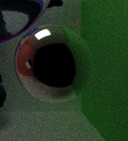 | 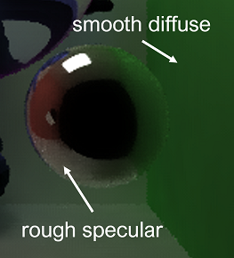 |

### Refractive
Refraction also causes a loss of sharpness for the same reason as reflection. The lack of geometry is a problem, as the smoothing causes shadows and sharp features behind refractive objects to be lost. In the Cornell with Wahoo scene, we lose a lot of detail on Mario's face even with 500 iterations.
| Baseline (5000 iterations) | `F`=65, `c`=0.138, `n`=0.030, `p`=0.262, iter=500 |
| ---------- | ---------- |
| 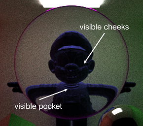 | 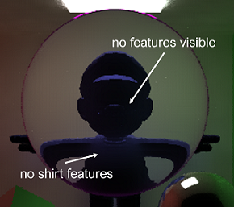 |

## Effectiveness of Scene
As seen in the sample images of the Cornell Ceiling Light and Cornell with Wahoo scenes in the "Iterations Required for Smooth Images" section above, the ceiling light scene performs better because there are less details to lose. The wavelet filter performs best when there are few reflective and refractive objects that would occlude the camera from seeing the geometry of the previous ray segment. When all surface geometric data can be known from the camera's POV, A-Trous performs very well.

# Debug Images
| Surface Positions |
| ---------- |
| 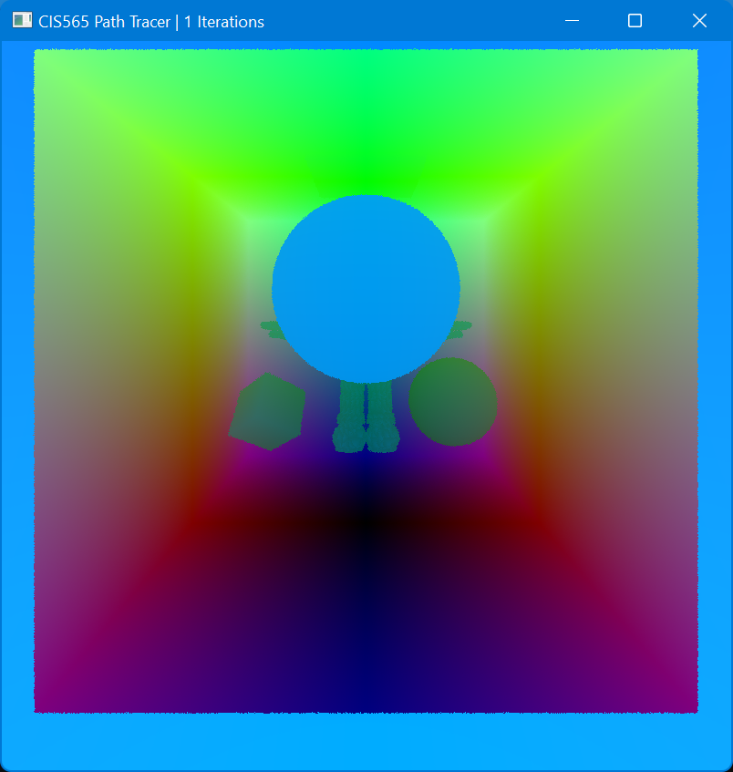 |

| Surface Normals |
| ---------- |
| 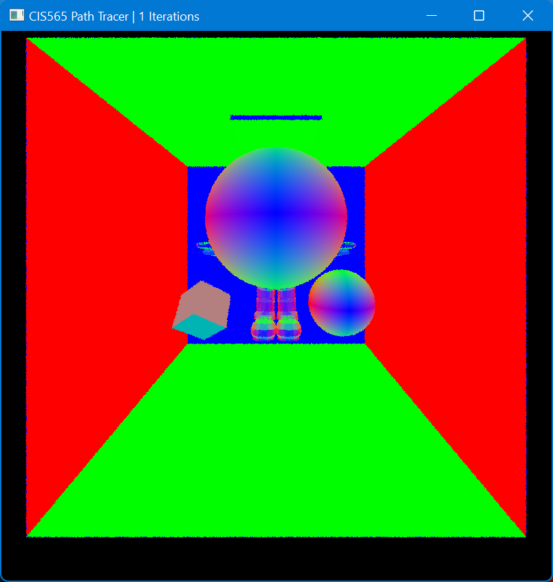 |

| Updated GUI (note toggles for position and normal G-buffers) |
| ---------- |
| 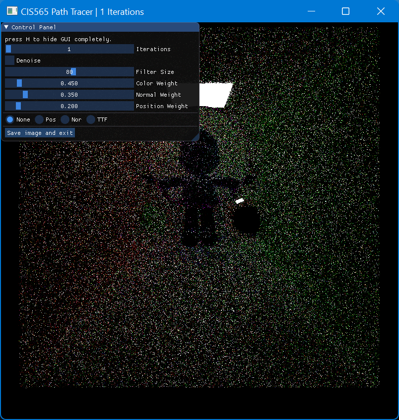 |

# Flags
The following flags can be used to toggle various options.
* `INSTRUMENT_FILTER` in `main.cpp` enables total path tracing timing measurements (path trace + denoise if enabled) and console printing

# References
* Dammertz et. al. Edge-Avoiding À-Trous Wavelet Transform for fast Global Illumination Filtering
  * https://jo.dreggn.org/home/2010_atrous.pdf