CUDA Denoiser For CUDA Path Tracer
==================================

**University of Pennsylvania, CIS 565: GPU Programming and Architecture, Project 4**

* Bowen Deng
  * [LinkedIn](www.linkedin.com/in/bowen-deng-7dbw13)
* Tested on: Windows 10, AMD Ryzen 9 5900HX with Radeon Graphics @ 3.30GHz 16GB, GeForce RTX 3070 Laptop GPU 8GB (Personal Computer)

## Abstract

A pathtracing denoiser based on the paper [Edge-Avoiding À-Trous Wavelet Transform for fast Global Illumination Filtering](https://jo.dreggn.org/home/2010_atrous.pdf), which utilizes geometry buffers to guide a smoothing filter.

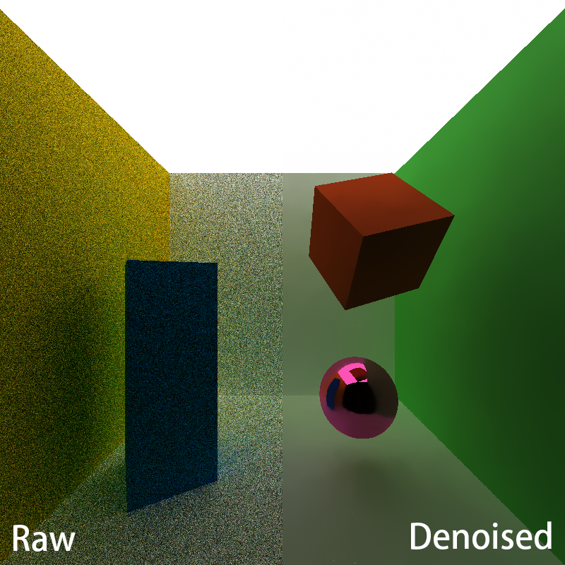
> Scene: scenes/denoise.txt

## Edge-Avoiding À-Trous Wavelet Filter

The À-Trous wavelet transform is kind of technique that approximates blur filters (like Gaussian), with fewer memory reads. The key is to use a small blur filter, and iteratively space out the samples going through it.

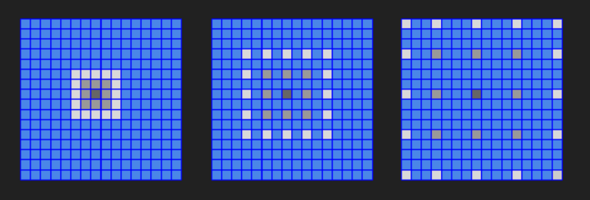

As shown above, a 5x5 filter is applied to approximate 16x16 blur by 3 iterations.

However, simply running a blur filter on an image often reduces the amount of detail, smoothing sharp edges. That is where "edge-avoiding" comes in. For a 3D scene, some information stored in geometry buffers (G-buffers) can be useful for guiding the filter to detect and preserve edges, such as per-pixel normals and per-pixel positions.

| scene | normal | position |
| ------------------------ | ------------------------ | ----------------------- |
|  | 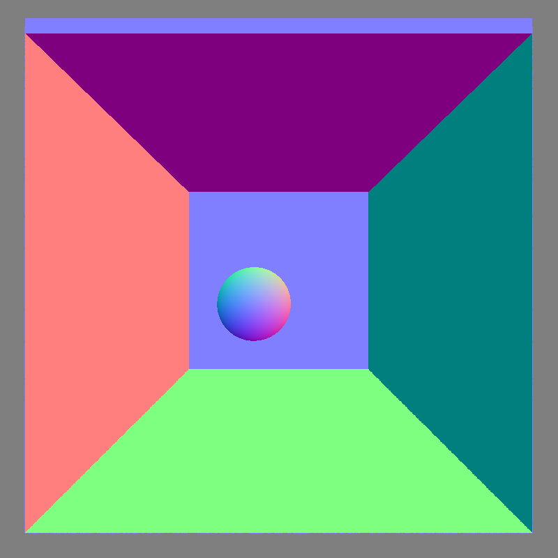 | 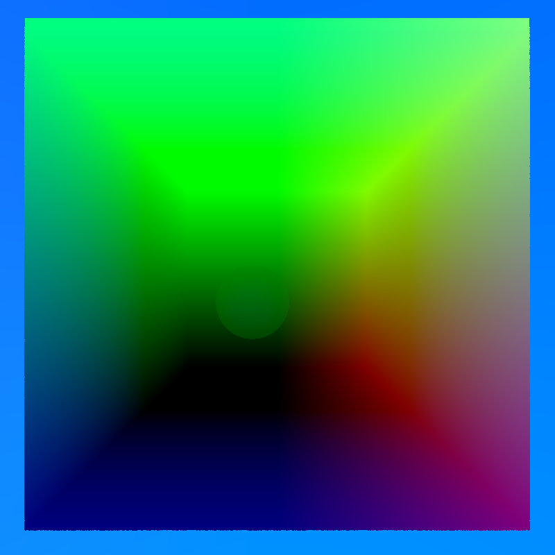 |
> Scene: scenes/cornell_ceiling_light.txt

According to these G-buffers, the edge-stopping function is added to the À-Trous filter, which diminshes the influence of neighboring samples that has far different values in G-buffers. As a result, the edge-avoiding À-Trous wavelet filter provides nice smoothing on planar surfaces while keeps the original edges.

| raw pathtraced image | simple blur | blur guided by G-buffers |
| ------------------------ | ------------------------ | ----------------------- |
| 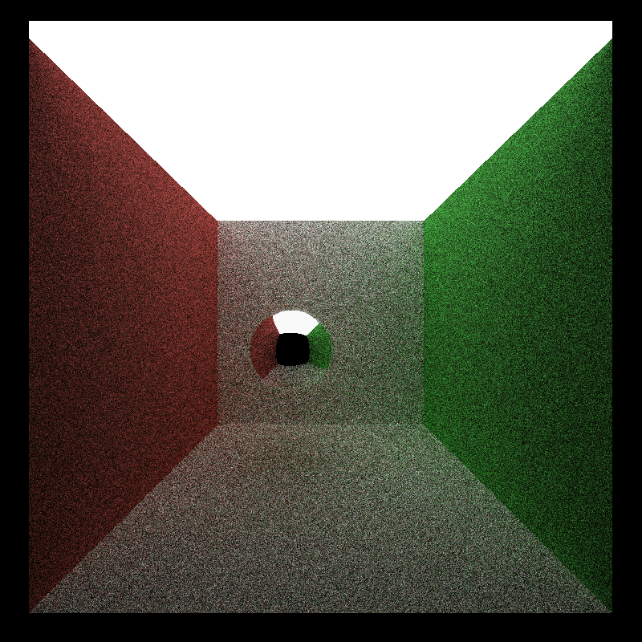 |  |  |

## Performance Analysis

### Measurement Metric

**A. Runtime Measurement**

To measure performance, CUDA events are applied to record the time cost for each iteration. The average runtime of path tracer is defined as total iterations rendered divided by total time elapsed, while the average runtime of denoiser is defined as its average time cost for running 100 times.

Both of the results will be shown in the title of the application.


This feature can be enabled by toggling this macro defined in `src/main.h`
```
// Toggle for measuring performance
#define RUN_TIME 1
```

**B. Image Comparison**

The quality of a denoised result is measured as its difference from a reference image. Such ground truth is obtained by path tracing at 10000 spp. We use structural similarity index (SSIM) to perform image comparison, which ranges from 0 (totally different) to 1 (same).

The comparison script is located in `image_diff_tool/ssim.py`. It can be used in the following way and the computed SSIM will be printed.
```
python ssim.py -f DIR_TO_FIRST_IMG -s DIR_TO_SECOND_IMG
```

### Performance of Denoising

| pathtraced image at 10spp | denoised image | reference |
| ------------------------ | ------------------------ | ----------------------- |
|  |  |  |
| SSIM = 0.4707 | SSIM = 0.9902 | SSIM = 1 |

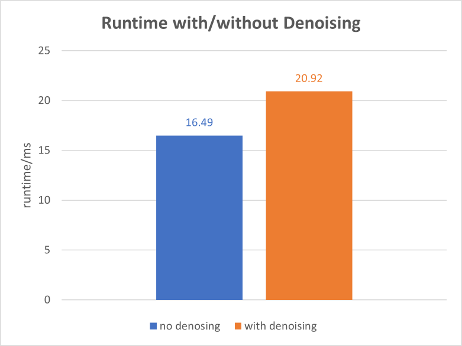

The result shows significant improvement after applying denoiser to the raw pathtraced image, both visually and from SSIM measurement. If we consider `SSIM > 0.98` and no obvious artifacts as a "acceptably smooth" result, experiments show that at least 2500 iterations are needed for a path tracer.

| pathtraced image at 2500spp | reference |
| ------------------------ | ----------------------- |
| 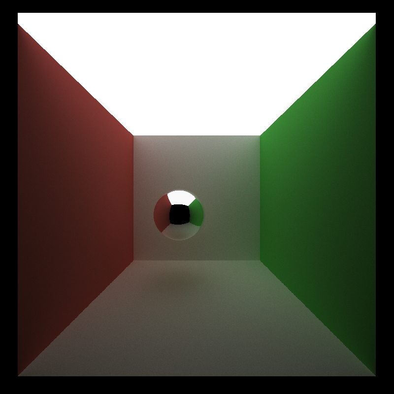 |  |
| SSIM = 0.9831 | SSIM = 1 |

However, with fine-tuned parameters, the denoised image with 10 iterations path tracing shows even higher similarity! The parameters we use are shown as below.

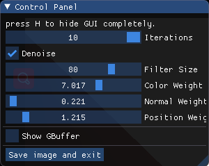

### Denoising at Different Image Resolutions

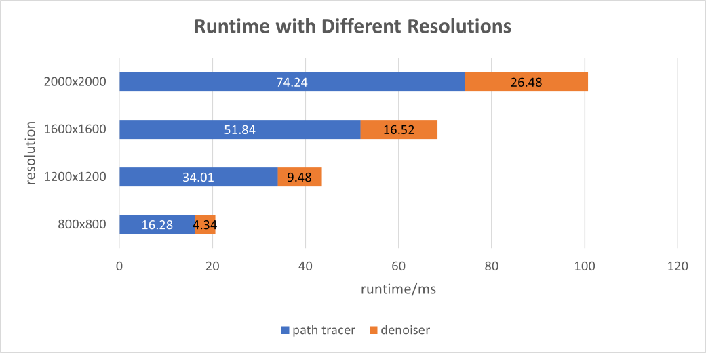

If the resolution of the rendered image changes, the runtime of denoiser should change with the same ratio, since it performs filtering for fixed iterations. This can be confirmed in above figure. On the other hand, it is noticed that as the resolution grows, the proportion of total runtime for denoising becomes larger.

### Denoising with Different Filter Sizes

Since À-Trous wavelet transform uses more filtering iterations to approximate larger filter, the effective filter sizes are 5, 9, 17, ... (corresponding to 1, 2, 3, ... iterations).

| pathtraced image at 10spp | 5x5 filter | 9x9 filter |
| ------------------------ | ------------------------ | ----------------------- |
|  | 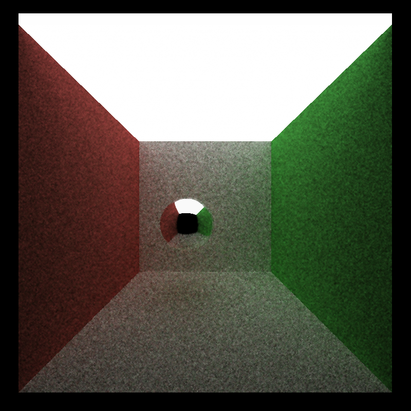 |  |
| SSIM = 0.4707 | SSIM = 0.8094 | SSIM = 0.9659 |

| 17x17 filter | 33x33 filter | 65x65 filter |
| ------------------------ | ------------------------ | ----------------------- |
|  |  |  |
| SSIM = 0.9876 | SSIM = 0.9901 | SSIM = 0.9902 |

As the filter grows larger and larger, the result is more and more smooth. Speckles can be observed when the filter size is small, and they becomes larger and less obvious until vanishing if applying a larger filter. Anyway, even denoising with a small filter can help improve SSIM a lot, since SSIM measures the structural information. The visual quality does not scale uniformly with filter size. Also, the runtime is measured at each filter size.

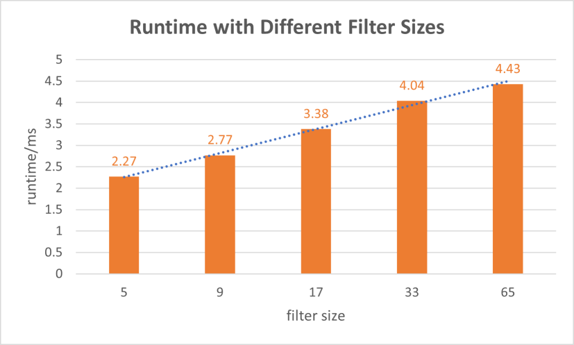

As expected, the runtime increases nearly linearly as the filter size (i.e. the number of filtering iterations).

### Denoising for Different Material Types

The motivation of the work in [Edge-Avoiding À-Trous Wavelet Transform for fast Global Illumination Filtering](https://jo.dreggn.org/home/2010_atrous.pdf) is from the following observation.

>The incident irradiance at a single point on a surface is described by the integral over the hemisphere. Under interactive or real-time constraints a path tracer can only trace a single path per pixel thus estimating the integral with a single sample only. But if neighboring hemispheres are similar one would expect similar integrals. Therefore the smoothing tries to average samples with a similar hemisphere.

It can be inferred that such denoising method may work well on diffuse surface, where the reflection is evenly distributed in the hemisphere. However, for specular or refractive surface it may fail since the light distributions vary a lot even for neighbor points.

| pathtraced image at 10spp | denoised image | reference |
| ------------------------ | ------------------------ | ----------------------- |
| 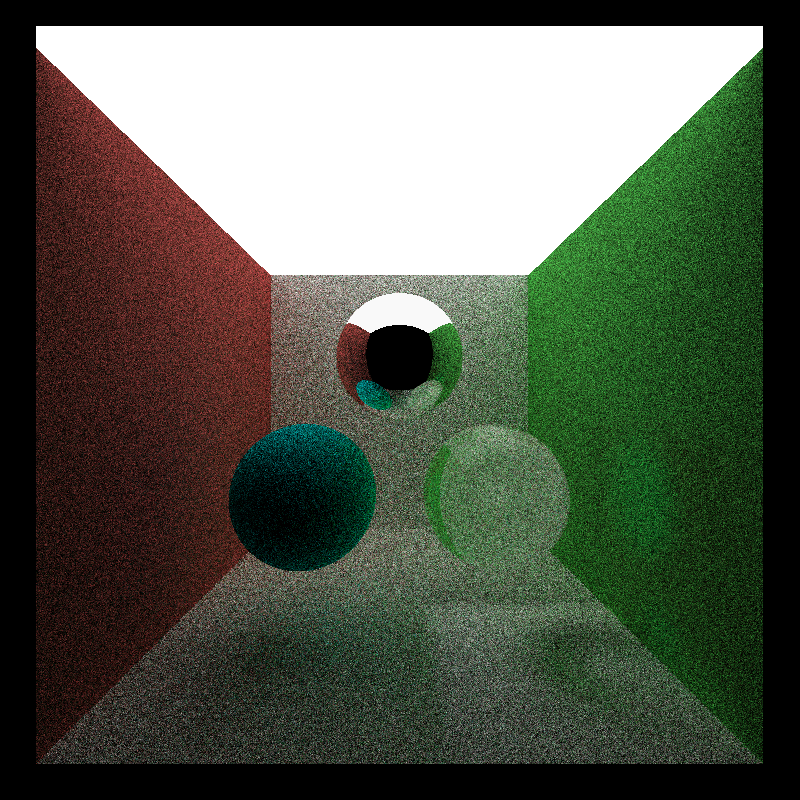 |  |  |
> Scene: scenes/diff_mat_ceiling_light.txt

The lower-left diffuse sphere seems very close to reference after denoising, but the other two does not. For the upper specular sphere, the reflected two spheres on its surface are actually blurred, since our G-buffers can not capture edges there. For the lower-right refractive sphere, the denoised result loses many details because the reflections/refractions are very point-dependent, and so benefits from averaging neighbor points are limited.

### Denoising for Different Scenes

The effect of denoising can differ greatly for different scenes.

| pathtraced image at 10spp | denoised image | reference |
| ------------------------ | ------------------------ | ----------------------- |
| 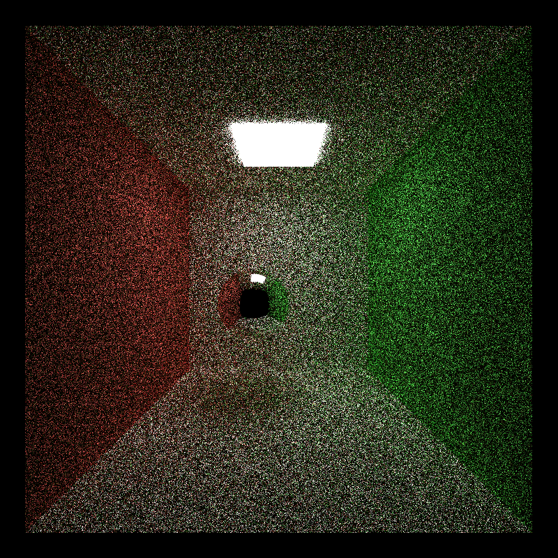 | 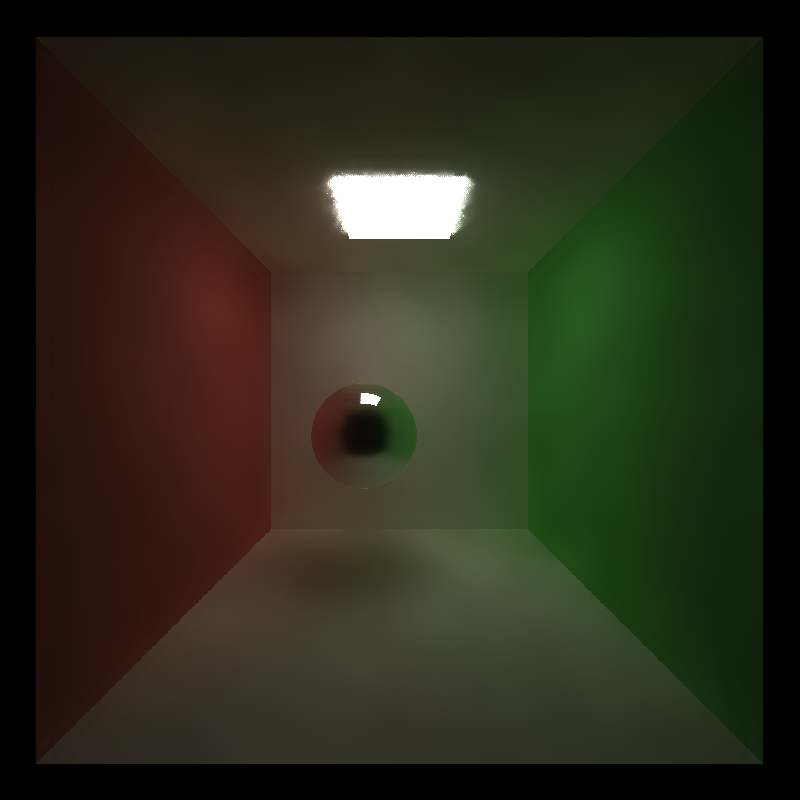 | 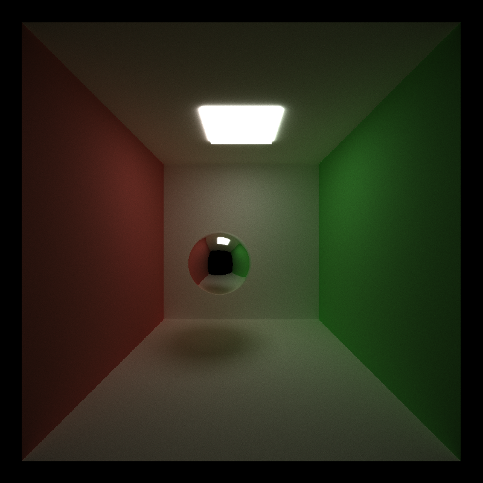 |
| SSIM = 0.2198 | SSIM = 0.9559 | SSIM = 1 |
> Scene: scenes/cornell.txt

Compared to result on `Scene: scenes/cornell_ceiling_light.txt`, the denoised image for this scene shows many artifacts, especially on surface of the sphere. This is because the light in this scene is very small that many samples do not reach it before terminated. The lack of information in original image makes neighbor average based denoising less effective.

**NOTE: Due to some technical issues, this denoiser can not work with the antialiasing feature of my path tracer for now :(. I will try to fix it in future.**

## Extra Part

### À-Trous vs. Gaussian

Recall that À-Trous is used to approximate a Gaussian filter. To make a comparison, a Gaussian filter is implemented with sigma of 20.

| pathtraced image at 10spp | reference |
| ------------------------ | ----------------------- |
|  |  |
| SSIM = 0.4707 | SSIM = 1 |

| 5-pass À-Trous | 65x65 Gaussian |
| ------------------------ | ----------------------- |
|  | 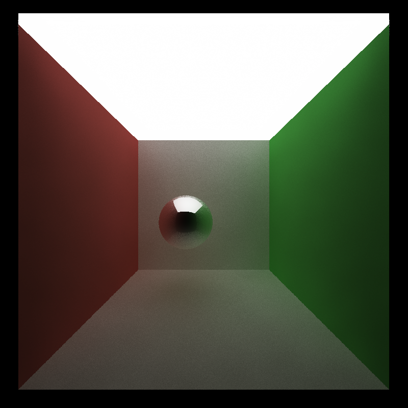 |
| SSIM = 0.9902 | SSIM = 0.9557 |

The main difference between results from these two filtering is that Gaussian blurs the surface of the specular sphere. A possible reason is that À-Trous samples neighbor pixels sparsely, and so better keeps edges which can not be captured by G-buffers.

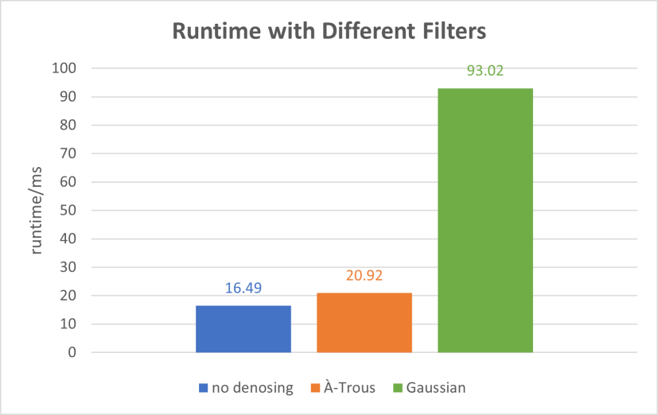

Surprisingly, using the full Gaussian filter dramatically reduces the performance. The runtime of denoising is even multiple times more than that of path tracing itself.

## Reference

* Edge-Avoiding À-Trous Wavelet Transform for fast Global Illumination Filtering, https://jo.dreggn.org/home/2010_atrous.pdf.
* ocornut/imgui, https://github.com/ocornut/imgui.
* Gaussian Filter Generation in C++, https://www.geeksforgeeks.org/gaussian-filter-generation-c/.
