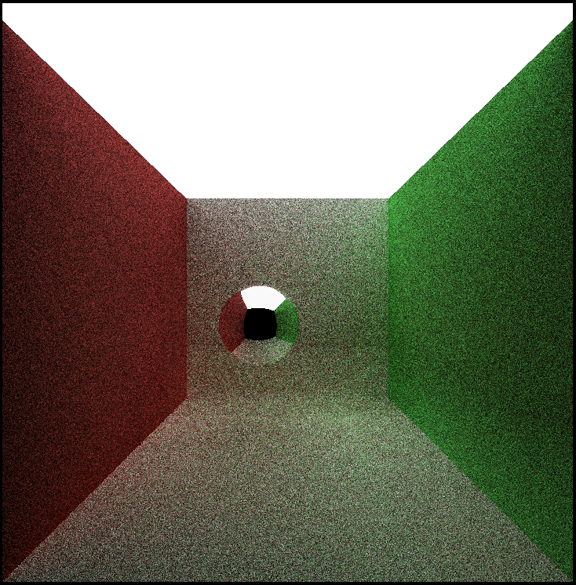
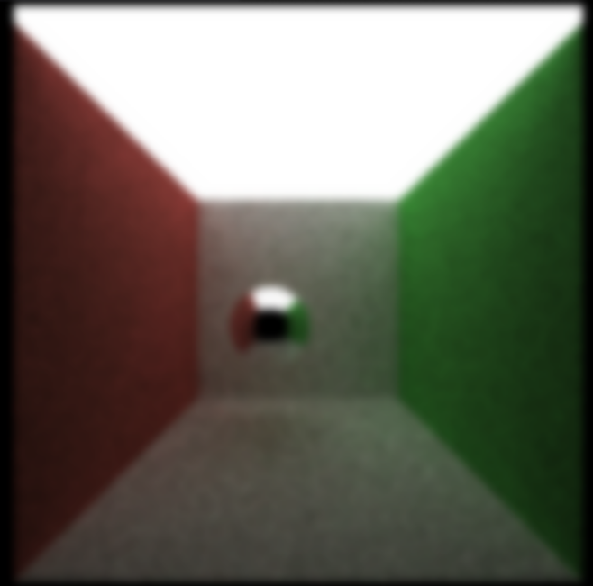
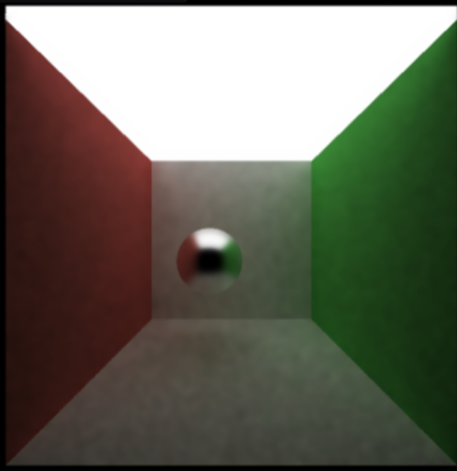
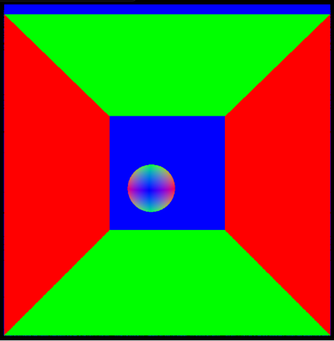
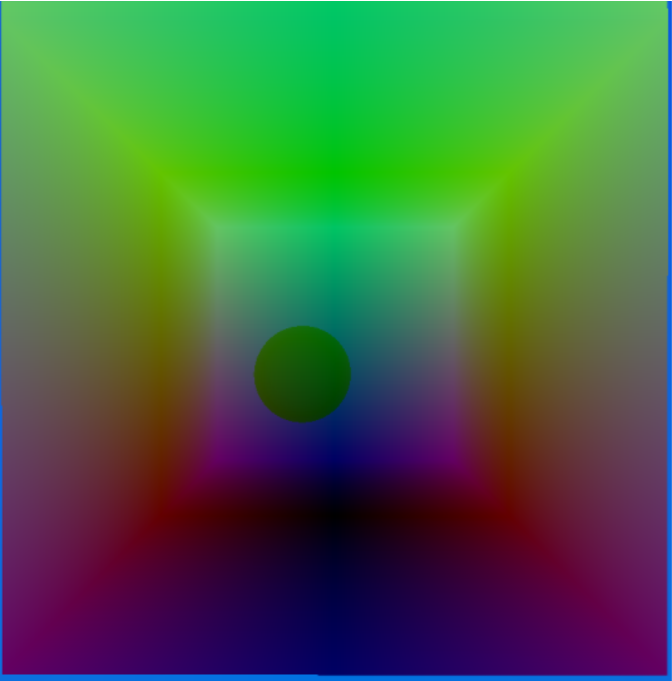
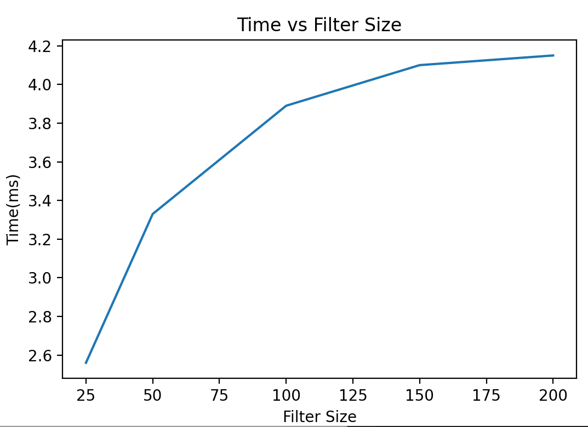
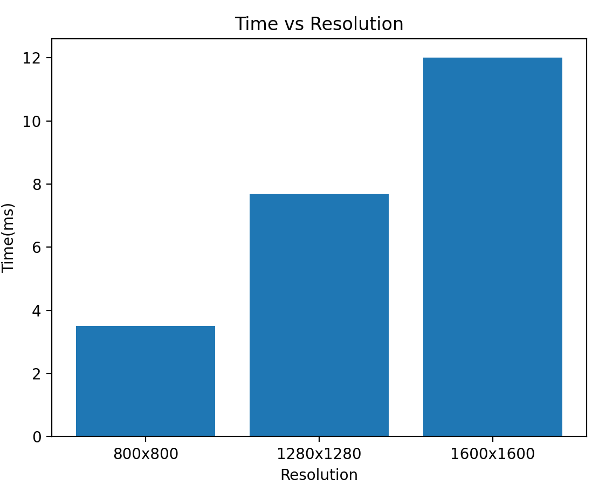
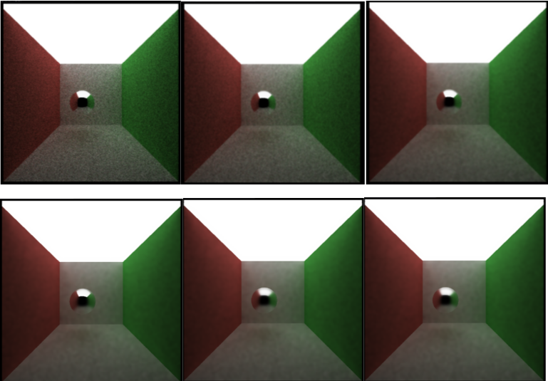
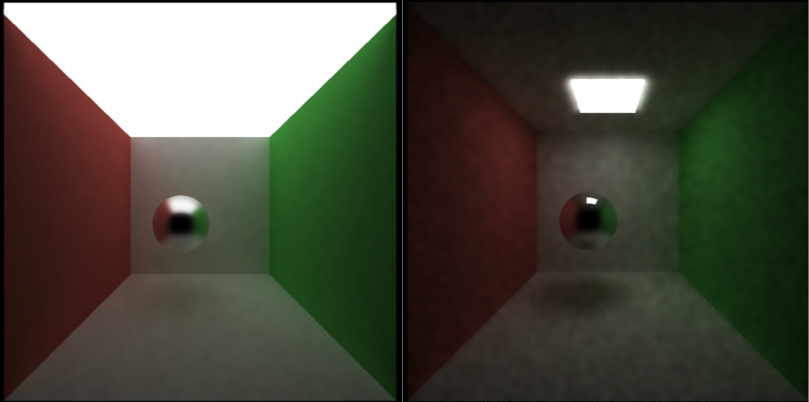

CUDA Path Tracer
================

**University of Pennsylvania, CIS 565: GPU Programming and Architecture, Project 4**

Nuofan Xu, Windows 10, AMD Ryzen 3800X, RTX2080 Super

A CUDA-accelerated path tracer: a global-illumination renderer with a denoiser to provide clearer images. 

CUDA Denoiser For CUDA Path Tracer
==================================

The technical details of the denoising technique used in this project is detailed in ["Edge-Avoiding À-Trous Wavelet Transform for fast Global Illumination Filtering"](https://jo.dreggn.org/home/2010_atrous.pdf). The idea is to blur the image while preserving the edges. We all know that noisy image is usually perceived as worse images compared to images that are not sharp enough. By smoothing over large noisy areas but the edges, this will give the appearance of a sharper, denoised image because shapes will remain intact. We can determine the extent of denoising by adjusting weights based on position, normals, and color of the scene elements. 

Gaussian blur has the effect of reducing the image's high-frequency components; a Gaussian blur is thus a low pass filter. Although a true Gaussian blur is effective, it requires a large amount of computation. By implementing the À-Trous Wavelet transform we are able to spread out the coordinates of the Gaussian kernel. This results in far fewer iterations and computation than a true Gaussian but a larger blur area.

Here we can see the difference between the images where there is no denoising (raw image), a blur with no edge detection (simple blur), and the blur with edge detection (Edge Avoiding A-Trous). All of these images went through 10 iterations of the pathtracer.

| raw pathtraced image | simple blur | blur guided by G-buffers |
|---|---|---|
||||

The visualization of the per pixel position and normals of the objects which are used as reference of weights are also shown below. This gives us some more insight on how they are able to help us with generating weights for edge detection.

| per-pixel normals | per-pixel position |
|---|---|
|||

# Performance Analysis

The relationship between running speed of the pathtracer and the filter size applied is investigated. As we can see from the performance plot, the filter size of the denoiser increases the time it takes for the denoiser to run, but the effect does not scale linearly - as the filter size becomes bigger, the increase speed of running time slows down logarithmically. This makes sense because the denoiser will have to consider a larger area of the image each time, and the À-Trous algorithm depends on a log2 of the filter size.

The relationship between running speed of the pathtracer and the image resolution is also investigated. We can see from the plot that as the resolution increases the runtime also increases, because an image with a higher resolution will have more pixels that the pathtracer and denoiser need to look at with each iteration. This time, the increase looks linear.

## Qualitative Analysis

The effect of filter size on the actual plot is investigated. From the image below, we can see that the appearance of our image does not scale uniformly with filter size.  After filter size is greater than 150, the difference in the images becomes negligible. In contrast, the difference between a filter of small sizes such as size 25 and size 50 is much more substantial. The experiment stops at filter size of 250 as no difference is observed by further increasing the filter size.

| filter size = 25 | filter size = 50 | filter size = 100 | 

| filter size = 150 |filter size = 200 | filter size = 250 |

As in the previously implemented setting, the ball is specular and the walls are fully diffusive. We can
observe that denosing effects are different on different materials. Some surfaces such as diffusive surfaces are much more compatible with the blur. This is as expected as a diffused surface is essentially one color. There is not really any information being lost when the kernel is applied to that part of the image. The surface getting blurred is effective at making it look better as there's a high chance that undesired noise are removed and edges are preserved. This is not the case however with refractive and specular materials. These materials generally create specific reflections of light or the surrounding scene. When these reflections get blurred out by the denoiser they no longer truly look like the material they are supposed to be. This is especially noticeable in the refractive material objects where the contrast between the object and the reflections are not as great and the entire interior of the object gets blurred. It no longer looks like glass because the visuals that make it refractive are not seen.

We can also see how the amount of light in the scene impacts the effectiveness of the denoiser. A darker scene makes it much more difficult for the denoiser to produce a good image. The same filter size, iterations, and weights were used to produce both of these images, but the lack of light in the second one makes it appear much noisier.

| Good Lighting | Poor Lighting |
|---|---|

## Feedback
Any feedback on the project is welcome.