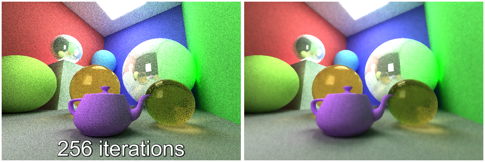
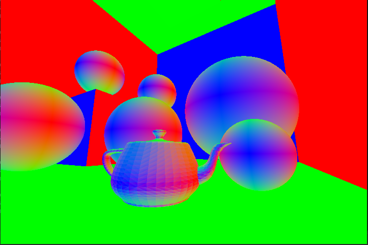
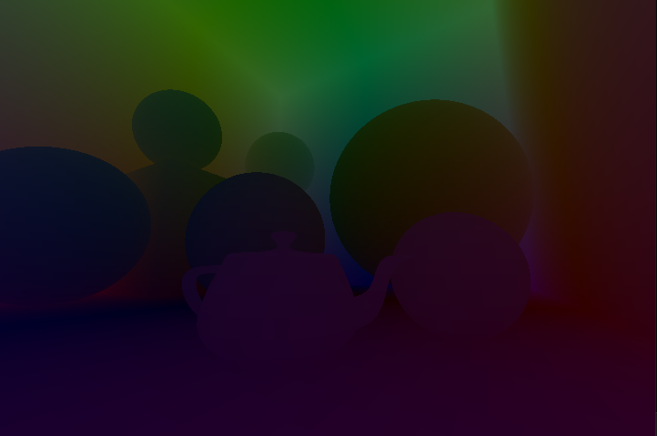
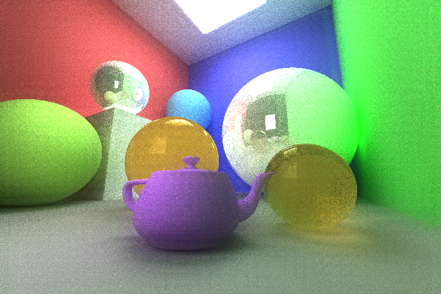
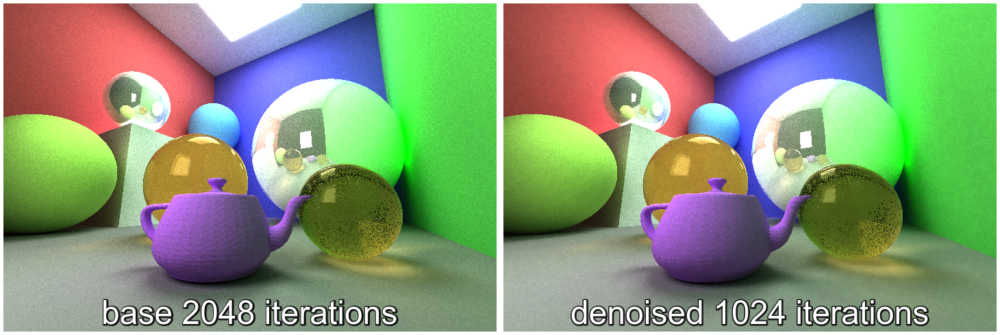
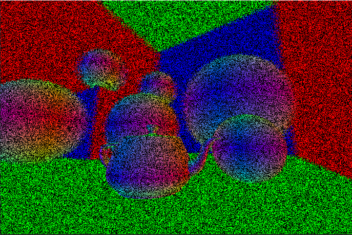

CUDA Denoiser For CUDA Path Tracer
==================================

**University of Pennsylvania, CIS 565: GPU Programming and Architecture, Project 4**

* Matt Elser
  * [LinkedIn](https://www.linkedin.com/in/matt-elser-97b8151ba/), [twitter](twitter.com/__mattelser__)
* Tested on: Tested on: Windows 10, i3-10100F @ 3.6GHz 16GB, GeForce 1660 Super 6GB

### Features

This is an implementation of A-Trous wavelet denoising as described in
[Edge-Avoiding A-Trous Wavelet Transform for fast Global Illumination Filtering
by Dammertz et. al.](https://jo.dreggn.org/home/2010_atrous.pdf). 

*NOTE* This repo only contains the denoise features added to a minimal
pathtracer. To see this denoiser in a more featured pathtracer (from which all
sample images were generated), check out [my pathtracer
repo](https://github.com/mattelser/Project3-CUDA-Path-Tracer)

A-Trous wavelet denoising works by approximating a Gaussian blur kernel and
incorporating data from "Gbuffers". These Gbuffers are data gathered from the
scene, and for this implementation include:
- surface normal 
- surface position 
- image color

### Performance
In comparing rendertimes between the full-featured pathtracer with no denoise
code and the full-featured pathtracer running the denoise kernel, no notable
performace difference was found across multiple iteration counts and multiple
resolutions for low filter sizes (e.x. a 15x15 pixel kernel). Large filter
sizes (e.x. an 80x80 pixel kernel) slowed render times by ~5%, but large
filters are generally undesireable since they cause visual artifacts. Note the
banding around the edges of the room in the following image, rendered with an
80x80 filter.

Scenes that produce less noise (e.x. those with larger light sources) also
produce better source images for the denoiser.

### Visual Improvement
the following comparison shows three columns. The
first is an untouched pathtracer render, the second is a denoised version of
that render, and the third is the visual difference between them (the stronger
the red, the greater the difference at that pixel). Denoise parameters were kept
constant for all renders.

As the above image shows, the denoiser is capable of improving even an
extremely noisy image. Also, as the iterations increase, the denoiser does not
noticeably reduce image quality. The fact that the difference images get
progressively less red indicates that  the source image and the denoise image
are converging towards one agreed upon image.

The visual gains of the denoiser are most dramatic with the extremely noisy
low-iteration images, but the most practical aspects are available at slightly
higher iteration values. Notice how little a visual difference exists between
the following two images:

The left image took twice as much computation to achieve approximately the same
result!

### Known limitations

The gbuffers only take into account surface info, which makes it less effective
for reflective and refractive surfaces. Note in the gbuffers above that the
reflective/refractive spheres show the same position and normals as a diffuse
sphere instead of the position or normal of what they reflect/refract. One way
to solve this would be to adjust the gbuffer based on the shader and one or
more bounced rays.

The denoiser does not work well with depth of field. The gbuffers are rebuilt
each iteration, but with depth of field the camera rays change each iteration.
The shifting rays lead to inconsistant results from iteration to iteration, and
whereas the un-denoised image sums these iterations and converges, the denoiser
does not. The image below shows the normal gbuffer with depth of field enabled.
The dark pixels are unexpected and may indicate a bug.

One way to fix this would be to have the gbuffers accumulate over
time. This fix could pair well with the previously mentioned fix for
reflective/refractive surfaces.

