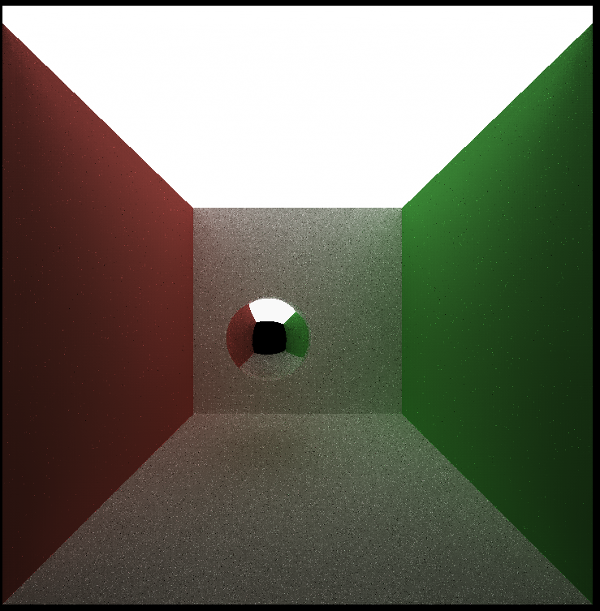
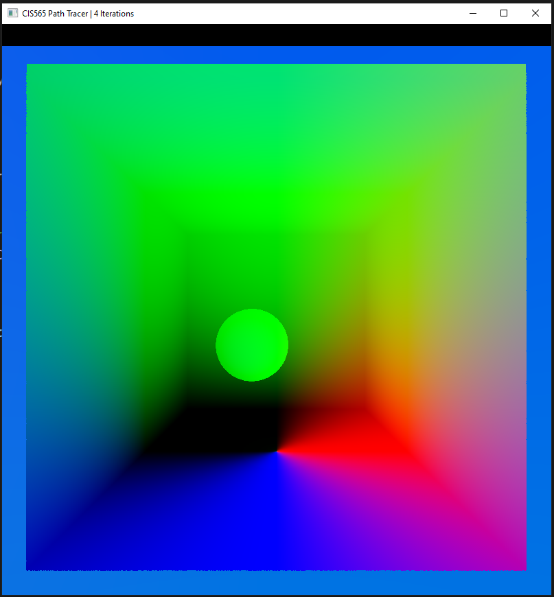

**University of Pennsylvania, CIS 565: GPU Programming and Architecture**
# Project 4 - CUDA Denoiser for CUDA Path Tracer

* Jonas Oppenheim ([LinkedIn](https://www.linkedin.com/in/jonasoppenheim/), [GitHub](https://github.com/oppenheimj/), [personal](http://www.jonasoppenheim.com/))
* Tested on: Windows 10, Ryzen 9 5950x, 32GB, RTX 3080 (personal machine)

## Introduction
We saw during the previous project that it takes many hundreds or even thousands of iterations for the noise to dissipate in a path traced image. The purpose of this project is to implement a clever technique that denoises a path traced image after only a handful of iterations. The technique is described in the paper "[Edge-Avoiding A-Trous Wavelet Transform for fast Global Illumination Filtering](https://jo.dreggn.org/home/2010_atrous.pdf)," by Dammertz, Sewtz, Hanika, and Lensch.

The naive way to reduce noise in a path traced image would be to apply a Gaussian blur filter. This would be naive because edges that should be sharp would instead end up looking blurred. So what we _really_ want to do is only do this sort of blurring _within areas that, sortof, are one piece_.

The idea presented in the paper is to instead store per-pixel information and then use this information to allow pixels to compare themselves to their neighbors in order to selectively apply the blur. First, the path tracer is run for a few iterations and per-pixel information is stored in what is called a "gbuffer". This information includes position and normal vectors. Then, every pixel looks at surrounding pixels and compares its gbuffer data to the neighbors' gbuffer data to see which neighbors are similar and should be blurred.

## Implementation
The implementation was fairly straight forward. The paper itself reluctantly provides some hints at implementation details towards the end in the form of a GLSL fragment shader. I used a separate `void denoise()` CPU-side function wrapping a denoising kernel call. The assignment made it sound like we should denoise after every iteration of pathtracing, and its conceivable that this would have produced the best results. Instead, I tried invoking my denoising kernel a single time at the end of all pathtracing iterations.

## Questions
### Qualitative
1. The denoising procedure runs as quickly as a single iteration of path tracing. This is a huge result. The visual gains from denoising are worth hundreds or even thousands of pathtrace iterations. It is clear that the most efficient way to get the best result is to perform some low numer of pathtrace iterations and then denoising.

    

2. Without denoising, an acceptably smooth result is achieved by 1000 iterations of path tracing. Note that this is highly subjective. _With_ denoising, only 25 iterations are needed to achieve a comparably smooth result. The grainyness in the whites is due to issues with color compressing.

    | 1,000 iterations of path tracing w/o denoising | 25 iterations of path tracing w/ denoising |
    |---|---|
    |||

3. The runtime complexity of this algorithm is clearly linear because the operation done on each pixel is constant, for a given filter size. The slightly upward bending curve suggests that there is some penalty in terms of hardware efficiency, e.g. block size.


4. Filter size is computed on the CPU in the following way:
    ```
    for (int power = 0; power < filterSize; power++) {
        int stepWidth = 1 << power;
        ...
    }
    ```
    and then each thread inside the kernel on the GPU uses this `stepWidth`, along with an array of `glm::vec2`s to compute offsets:
    ```
    for (int i = 0; i < 25; i++) {
        glm::vec2 uv = pixelCoord + offset[i] * stepWidth;
        ...
    }
    ```
    Increasing the filter size changes the number of times the kernel executes, but does not change the complexity of the kernel invocation, and so the runtime increases linearly.
    


    In addition to the above, you should also analyze your denoiser on a qualitative level:
### Qualitative
1. Visual quality improves as filter size increases until about five (which translates to 2^5*5=160, so 160x160), after which point there is little improvement. This makes sense, since the "distance" with respect to position and normal between the center pixel and the farther out pixels will get large enough that the color contributions are effectively erased.

2. The denoising procedure seems to work best with diffuse materials with solid colors because colors of neighboring pixels are most likely to be similar. It is seen that the diffuse sphere looks essentially perfect, while the edges of the reflective sphere still have some noise that couldn't be smoothed out.

    | Diffuse sphere | Reflective sphere |
    |---|---|
    |||

3. The results vary from scene to scene. Because it is sampling so few neighboring pixels compared to a full Gaussian filter, ever pixel counts for a lot. In low-light situations where the image is extremely noisy, the denoising procedure struggled.

    | Best cornell large light | Best cornell small light |
    |---|---|
    |||

## Debug images
| positions | normals |
|---|---|
|||

## Bloopers
The bloopers were absolutely a highlight of the project. The bottom right is my favorite :)
|  |  |
|---|---|
|||
|||