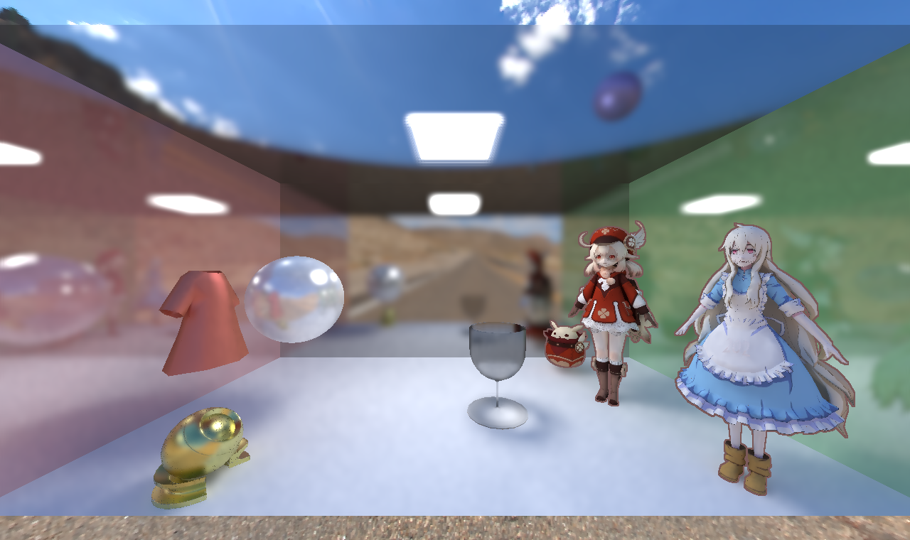
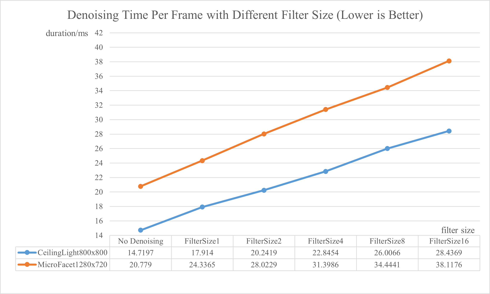

CUDA Denoiser For CUDA Path Tracer
==================================

**University of Pennsylvania, CIS 565: GPU Programming and Architecture, Project 4**

* Xuntong Liang
  * [LinkedIn](https://www.linkedin.com/in/xuntong-liang-406429181/), [GitHub](https://github.com/PacosLelouch), [twitter](https://twitter.com/XTL90234545).
* Tested on: Windows 10, i7-10750H @ 2.60GHz 16GB, RTX 2070 Super with Max-Q 8192MB

## Features

### Overall

- Implemented the A-trous wavelet filter.
- Implemented the edge avoiding A-trous wavelet filter.
- Implemented temporal sampling.
- Implemented shared memory version (but still with some problem).

### A-Trous Wavelet Filter

A-trous wavelet filter is an approximation of gaussian filter. It provides filtered images by repeated convolution with different stride of generating kernels. This process only considers the final color so it may eliminate many high frequency features of an image. 

### Edge Avoiding A-Trous Wavelet Filter

Edge avoiding A-trous wavelet filter takes the advantage of bilateral gaussian filter. The weight of kernels could be computed with several edge-stopping function, which takes considerations of more features such as the surface normal, the position, instead of the final color only. In this case, we should generate a G-buffer in each frame. 

Here are some results that ran in two scenes, "Ceiling Light" and "Micro Facet".

| Ceiling Light 20 Iterations                                  | Ceiling Light 20 Iterations with Denoising                   | Ceiling Light 200 Iterations                                 |
| ------------------------------------------------------------ | ------------------------------------------------------------ | ------------------------------------------------------------ |
|  |  |  |

| Micro Facet 50 Iterations                                    | Micro Facet 50 Iterations with Denoising                     | Micro Facet 1500 Iterations                                  |
| ------------------------------------------------------------ | ------------------------------------------------------------ | ------------------------------------------------------------ |
|  |  |  |

These images show the effect of the filter. As a result of using the filter, we can get a less noisy image with clear edges within a few iterations, which is much faster than waiting for a lot of iterations without denoising to get a less noisy image. 

### Temporal Filter

If the camera, the lights or the objects moves, we can also take advantage of the spatial or temporal continuity of a sequence of images, which means that we can use historical data for denoising (temporal accumulation) as long as we can find the corresponding filtered pixel of the target noisy pixel in history (reprojection). The temporal filter process can be divided into two parts: reprojection and temporal accumulation.

| Ceiling Light without Temporal        | Ceiling Light with Temporal       |
| ------------------------------------- | --------------------------------- |
|  |  |

| Micro Facet without Temporal          | Micro Facet with Temporal         |
| ------------------------------------- | --------------------------------- |
|  |  |

I have not implemented the complete version of SVGF and do not separate direct illumination and indirect illumination, so it cannot reach the performance that SVGF does. But the figures above show that with temporal filter, we can keep much filtered data while moving the camera as much as possible. 

### Shared Memory Optimization

For each pixel, the filter process reads several neighboring pixels to compute a final value, so there are many pixels read for several times in each blocks. This process is likely to benefit from shared memory. 

I tried to implement shared memory optimization, but I found some problems at the boundary of the screen, and it only gets faster with a simple A-trous filter, but gets slower with the edge avoiding version. This disadvantage may comes from the large size of the G-buffer pixel. It even causes that I cannot make the block size and the filter size larger, otherwise there will be invalid arguments of calling the denoising kernels.

## Performance Analysis

### Filter Size and Resolution

I did the performance analysis with the two scenes and different filter size.

With the filter size increased, the duration of each frame becomes longer. It is obvious because it needs more wavelet filters if the filter size is larger. It is also obvious that it spends more time for larger resolutions. 

So how do the filter size influence the image? In a diffuse scene, increasing filter size may have little effect ("Ceiling Light"), while in a scene with more specular objects, or with smaller lights, it still affect much ("Micro Facet"). Here are some results with filter size greater than or equal to 4.

| Ceiling Light Filter Size 4                                  | Ceiling Light Filter Size 8                                  | Ceiling Light Filter Size 16                                 |
| ------------------------------------------------------------ | ------------------------------------------------------------ | ------------------------------------------------------------ |
|  |  |  |

| Micro Facet Filter Size 4                                    | Micro Facet Filter Size 8                                    | Micro Facet Filter Size 16                                   |
| ------------------------------------------------------------ | ------------------------------------------------------------ | ------------------------------------------------------------ |
|  |  |  |

We can see that with the filter size larger, the light is more blurry in the scene "Micro Facet".

### Material Type

We can also infer that, the filter makes the glossy material more diffuse, as is also shown in the overall image. Also, I believe that the denoising effect on diffuse objects is better, so I think that we can also add considerations some properties of materials such as roughness, specular, in the filter.

### Shared Memory

My shared memory optimization only works better on naive A-trous wavelet filter, and may cause an error if the filter size is large with edge avoiding A-trous wavelet filter. 

TODO

### Temporal Filter

The aim of the temporal filter is to keep the historical data for denoising as much as possible, for interactive rendering applications, which means that we should get an acceptable render result in real-time. If it cost too much, it still be problem for real-time applications. 

In previous chapter, we can see that when the camera moves around, the duration of rendering is still acceptable. Next I provide analysis on temporal filter, compared with no denoising, and applying spatial filter only.

TODO

## Reference

1. [Edge-Avoiding A-Trous Wavelet Transform for fast Global Illumination Filtering](https://jo.dreggn.org/home/2010_atrous.pdf)
2. [Spatiotemporal Variance-Guided Filtering](https://research.nvidia.com/publication/2017-07_Spatiotemporal-Variance-Guided-Filtering%3A)

