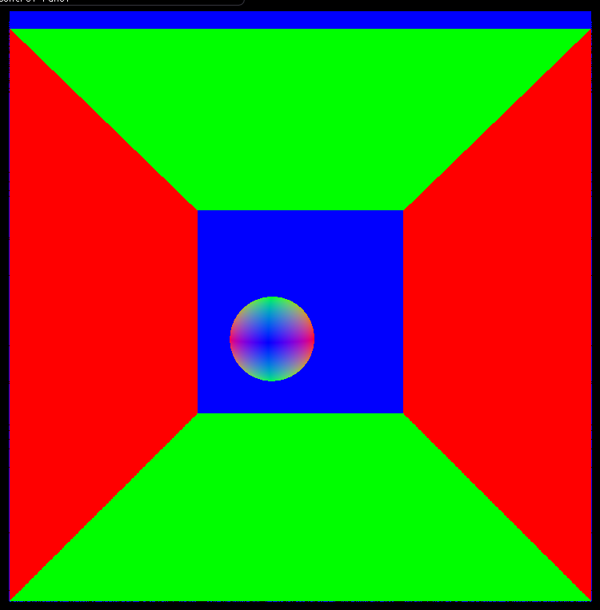

CUDA Denoiser For CUDA Path Tracer
==================================

**University of Pennsylvania, CIS 565: GPU Programming and Architecture, Project 4**

* Lindsay Smith
*  [LinkedIn](https://www.linkedin.com/in/lindsay-j-smith/), [personal website](https://lindsays-portfolio-d6aa5d.webflow.io/).
* Tested on: Windows 10, i7-11800H 144Hz 16GB RAM, GeForce RTX 3060 512GB SSD (Personal Laptop)

This project builds upon the Pathtracer I previously implemented by adding a denoiser to provide clearer images. The algorithm used
to do this denoising is detailed in ["Edge-Avoiding À-Trous Wavelet Transform for fast Global Illumination Filtering"](https://jo.dreggn.org/home/2010_atrous.pdf). 
The idea is to blur the image while preserving the edges. This will give the appearance of a denoised image because large noisy areas will get smoothed over, but the edges
and shapes will remain intact. We can use the position, normals, and color of the scene elements to apply weights to the blur that will determine how much denoising should be applied. Although a true Gaussian blur is effective, it requires a large amount of computation. By implementing the À-Trous Wavelet transform we are able to spread out
the coordinates of the Gaussian kernel. This results in a larger blur and far fewer iterations than a true Gaussian.

Here we can see the difference between the images where there is no denoising, a blur with no edge detection, and the blur with edge detection. All of these images
went through 10 iterations of the pathtracer.

| raw pathtraced image | simple blur | blur guided by G-buffers |
|---|---|---|
||||

We can also see here the visualization of the position and normals of the objects. This gives us some more insight into how the per-pixel normals and positions are
able to help us with the weights for edge detection.

| per-pixel normals | per-pixel position |
|---|---|
|||

# Performance Analysis

TODO: ADD TIMING AND CHARTS

## Qualitative Analysis

Another interesting thing to note is that the appearance of our image does not scale uniformly with filter size. The difference in the images when using a large filter size
becomes essentially non-existent. We can see from these images that the difference between a filter of size 20 and size 50 is much more substantial than the difference between a filter size of 100 to 120. 

| filter size = 20 | filter size = 50 | filter size = 100 | filter size = 120 |
|---|---|---|---|
|||||

If we continue to increase the filter size even further we start to see no difference at all.

| filter size = 200 | filter size = 300 |
|---|---|
|||

Another thing we can see through looking at the images produced is that certain materials are much more compatible with the denoiser. For example, a diffused surface works
very well with the denoiser because the surface is essentially one color. The surface getting blurred is effective at making it look better, and there is not really any information being lost. This is not the case however with refractive and specular materials. These materials generally create specific reflections of light or the surrounding scene. When these reflections get blurred out by the denoiser they no longer truly look like the material they are supposed to be.This is especially noticeable in the refractive material objects where the contrast between the object and the reflections are not as great and the entire interior of the object gets blurred. It no longer looks like glass because the visuals that make it refractive are not seen.

It is also interesting to note that with a more complicated scene it takes more than 10 iterations of the pathtracer to be able to produce a good denoised image. To obtain this denoised result I required 100 iterations of the pathtracer first. Of  course this is still significantly less iterations than the 5,000 we used to produce images with just the Pathtracer. We can see the difference that more iterations of the pathtracer make in these images. Both use a filter size of 200.

| iterations = 10 | iterations = 100 |
|---|---|
|||

We can also see how the amount of light in the scene impacts the effectiveness of the denoiser. A darker scene makes it much more difficult for the denoiser to produce a good image. The same filter size, iterations, and weights were used to produce both of these images, but the lack of light in the second one makes it appear much noisier.

| Good Lighting | Poor Lighting |
|---|---|
|||

## Bloopers

Incorrect clamp value for position and normals

| Position | Normals |
|---|---|
|||
