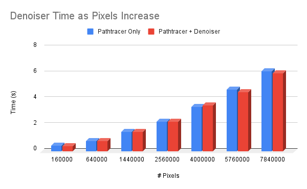

CUDA Denoiser For CUDA Path Tracer
==================================

**University of Pennsylvania, CIS 565: GPU Programming and Architecture, Project 4**

* Ashley Alexander-Lee
* Tested on: Windows 10, i9-11900H @ 2.50GHz 22GB, RTX 3070 

Description
==========

This denoiser is an implementation of [Edge-Avoiding A-Trous Wavelet Transform for Fast Global Illumination Filtering](https://jo.dreggn.org/home/2010_atrous.pdf). The goal was to decrease the pathtracer render time by using image denoising, which can approximate a converged result with a noisy render quicker (but perhaps less accurately) than additional iterations.

My approach was to take the beauty pass after all of the pathtracer iterations and run the denoiser on it (assuming the user checks Denoise in the gui). The first step was to apply an approximated gaussian blur. Given the desired filter (i.e. gaussian kernel) size, I calculate the number of kernel expansions that need to be done with `log2(filterSize/5)`, since the filter size doubles with every denoising iteration, as per the A-Trous method. By expanding the 5x5 kernel iteratively instead of using the full kernel, I could limit the amount of space required for the kernel, at the expense of compute. 

I maintained two device arrays: `dev_denoised` and `dev_denoised_tmp`. The later contained the accumulated wavelets, while the later held only the previous round's wavelet. During each round, I would add the calculated wavelet to `dev_denoised` and replace the values in `dev_denoised_tmp`. I also declared a 5x5 `dev_gaussian_kernel`, which contained the gaussian weights. Each surrounding pixel `q`'s contribution to the current pixel `p` was determined by `color_q * kernel_val * w(p, q)`. 

During depth 0, I create a GBuffer containing the position and the normal. During the denoising stage, I use those values to determine the weight w, which accounts for edge detection. 

Results
=======

### How Increasing Iterations Affects Outcome
As expected, I found that the more iterations you perform before denoising, the better the result. 

| Iterations | Beauty Render | Denoised | 
|-| ------------- | -------- |
| 10 |  |  |
| 100 |  |  |
| 1000 |  |  |
| 10000 |  |  |

As you can see, there are convincing results with as few as 100 iterations. In fact, if you compare the denoised render at 100 iterations and a render at 8,000, you will see that the results are very similar, and that you gain back almost 50s by denoising at 100 iterations instead of waiting for the image to converge at 8,000. 

| Iterations | Time to run (s) | Render |
| ---------- | --------------- | ------ |
| 100 (denoised) | 0.83333 |  |
| 8000 (not denoised) | 56.808 |  |

### How Scene Setup Affects Time to Converge
I found that the denoiser was able to produce a convincing image with fewer iterations for the scene that contained the bigger light, `cornell_ceiling_light.txt`. However, the scene that contained the smaller light, `cornell.txt`, required closer to 1,000 iterations to produce a render with the same fidelity as the first scene was able to produce with 100. This is due to the fact that `cornell.txt` takes longer to converge, since fewer rays are likely to hit the light in any one iteration. Therefore, it takes more iterations to produce enough meaningful light contribution, and, in turn, more iterations to provide the denoiser with enough information to properly smooth the image. 

*You see below that there are still artifacts after 100 iterations when you use a smaller light, and that you have a more converged image at 1000 iterations*
| Iterations | Beauty Render | Denoised Render |
| ---------- | ------------- | --------------- |
| 100 |  |  |
| 1000 |  |  |

### How Filter Size Affects Outcome
I found that as the filter size increases, the fidelity increases, but only up until a point. I found that a filter size of 80 or 160 seems to be the right balance -- as the filter size gets smaller, more noise contributes, and as the filter gets larger, artifacts appear as a result of having too large a kernel size. 

*I've made this chart more compact -- read it top->bottom, left->right*
| Filter Size | Denoised Render | Filter Size | Denoised Render |
| ----------- | --------------- | ----------- | --------------- | 
| 10 |  | 160 |  |
| 20 |  | 320 |  |
| 40 |  | 640 |  |
| 80 |  | | |

Performance
===========

Using my RTX 3070, I'm seeing no significant time add to run the denoiser, ranging from 0 - 0.001s. 

Even when I increase the resolution, I don't see a major decrease in performance. 

The filter size impacts the performance slightly, but the slope of the time increase is not too steep. 

Bloopers
========

### Radio Silence

