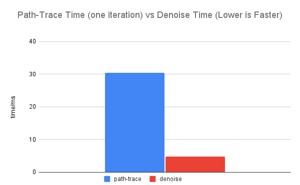
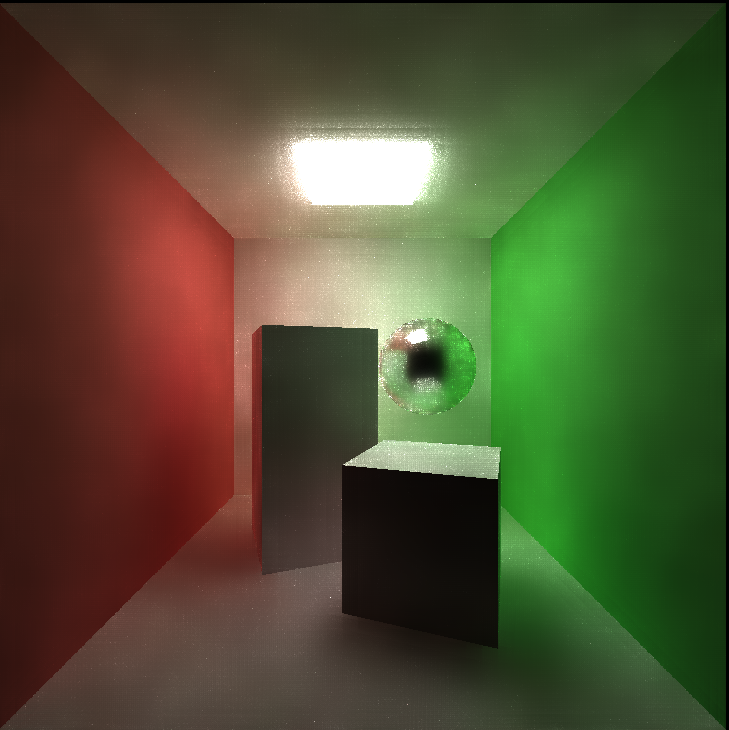

CUDA Denoiser For CUDA Path Tracer
================

**University of Pennsylvania, CIS 565: GPU Programming and Architecture, Project 4**

* Jiyu Huang
* Tested on: Windows 10, AMD Ryzen 7 5800H @ 3.20GHz 16GB, RTX 3070 Laptop 8GB

| 10 iterations, no denoising | 10 iterations, denoised |
| --------------------------- | ----------------------- |
|      |    |

This project builds on top of the [CUDA path tracer](https://github.com/JiyuHuang/Project3-CUDA-Path-Tracer) project, and implements an edge-avoiding A-Trous wavelet transform for image denoising. The technique is described in detail in https://jo.dreggn.org/home/2010_atrous.pdf.

# Analysis

The default scene used for performance analysis can be found at [scenes/cornell_ceiling_light.txt](scenes/cornell_ceiling_light.txt), with a camera resolution of 800x800. The optimal block size chosen for A-Trous filter CUDA kernel is 32x32. The default filter size chosen is 65.

## Denoising Time vs Path-Tracing Time

Path-tracing and denoising times and measured by taking the average of ten executions. Ten iterations are performed in each execution. As seen from below, denoising using A-Trous wavelet transform takes relatively little amount of time compared to one iteration of path-tracing. When performed after several iterations of path-tracing, A-Trous denoising takes almost no overhead.

## Image Comparison

| no denoising, 10 iterations | no denoising, 40 iterations | no denoising, 100 iterations |
| ----------------------- | ---------------------------- | ----------------------------- |
|    |  |  |

| denoised, 1 iteration | denoised, 4 iterations | denoised, 10 iterations |
| ----------------------- | ---------------------------- | ----------------------------- |
|  |  |  |

As seen from the tables, it takes roughly 100 iterations to get a smooth image without denoising, and even after 100 iterations, the result image still has noise if looked closely. To get cleaner image, the iteration number increases quadratically.

On the other hand, a denoised image looks smooth even with only one iteration, with the catch being that the image has color blob artifacts. At 10 iterations, the artifacts get reduced and the result is an acceptably smooth image.

## Camera Resolution and Denoising Time

The relationship between camera resolution and denoising time is as expected: run time increases as screen size (n x n) increases.

## Filter Size and Denoising Time

Denoising time increases logarithmically as filter size increases. This is due to the fact that for the A-Trous wavelet transform, in each level the step width multiplies by 2. Therefore, the number of levels for the wavelet transform increases logarithmically.

## Filter Size and Image Quality

| filter size: 5           | filter size: 9            | filter size: 17            |
| ------------------------ | ------------------------- | -------------------------- |
| |  |  |

| filter size: 33            | filter size: 65       | filter size: 129            |
| -------------------------- | --------------------- | --------------------------- |
|  |  |  |

Increaing filter size improves image quality, but the quality benefit gets smaller as filter size increases.

## Limitation: Reflective/Refractive Materials, Uneven Lighting

The edge-avoiding A-Trous filter uses position and normal information in its G-buffer to avoid blurring edges. For reflective or refractive materials, the filter can't effectively detect the edges in the reflection/refraction, and will blur the surfaces with those materials.

| no denoising | denoised |
| --------------------------- | ----------------------- |
|      |    |

For similar reasons, when the lighting condition isn't very even, the image result will also suffer.

| 10 iterations, even lighting condition | 10 iterations, not so even lighting condition |
| ----------------------- | --------------- |
|  |  |

## G-Buffer Optimization and Performance

To more efficiently store G-buffer information, we use z-depths and oct-encoded normals instead of positions and normals. There seems to be no apparent performance impact for this optimization. The difference seen in the graph is more of a result of performance time variance rather than any meaningful performance difference.

