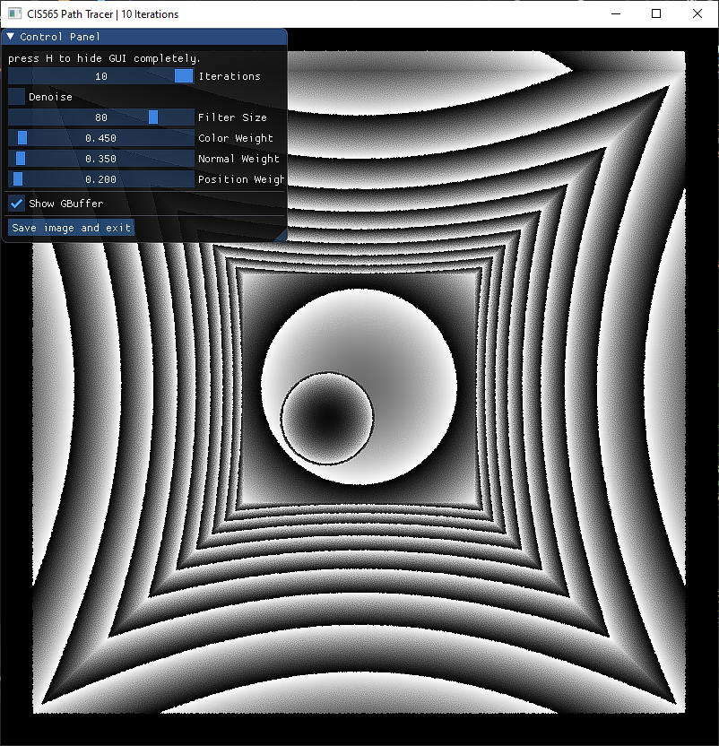

Project 4 CUDA A Trous Denoiser
======================

**University of Pennsylvania, CIS 565: GPU Programming and Architecture, Project 4**

* Raymond Yang
	* [LinkedIn](https://www.linkedin.com/in/raymond-yang-b85b19168)
	* Tested on: 
		* 10/22/2021
		* Windows 10
		* NVIDIA GeForce GTX 1080 Ti. 
	* Submitted on: 10/22/2021

## Introduction 
The objective of this project was to implement A Trous denoiser detailed in this [paper](https://jo.dreggn.org/home/2010_atrous.pdf). To construct the denoised image, we modulate a noisy path traced image (represented as a color buffer) with a geometry buffer/G buffer (represented as an array of positions and an array of normals). Both elements of the G buffer are cahced on first bounce and only done once per render. 

### Components of A Trous Denoiser
Scene Colors:

  

Scene Positions (relative to camera origin):

  

Scene Normals: 

  

Scene Time to Intersect (unused): 

  

### Denoised Output

  

## Performance Analysis
In this section, we compare the runtime costs of A Trous denoising, recorded in microseconds. For Simple Scene, we will use `scene/cornell_ceiling_light.txt`. For Slightly Less Simple Scene, we will use `scene/demo.txt`. For the purposes of consistency between runs, the following values will be hardcoded to the window unless otherwise specified: 
* `Filter Size = 80`
* `Color Weight = 8.f`
* `Normal Weight = 1.f`
* `Position Weight = 1.5f`

### Simple Scene
Baseline image for reference at 1000 iterations: 

  

Path trace time for 1000 iterations: 33679.50 ms
Denoise time for 1000 iterations: 62.97 ms

Path traced image after 10 iterations:

  

Path traced image after 10 iterations with A Trous denoiser:

  

#### Cost of Running Denoiser vs Path Tracer
| Trial           | 1        | 2        | 3        | 4        | 5        |
|-----------------|----------|----------|----------|----------|----------|
| Path Trace Time | 326.05   | 338.88   | 336.49   | 345.53   | 338.01   |
| Denoise Time    | 62.95    | 64.02    | 62.62    | 64.47    | 64.56    |

Lower is better:

  

#### Cost of Running Denoiser vs Resolution
| Resolution | 256x256   | 512x512   | 1024x1024 |
|------------|-----------|-----------|-----------|
| Time (ms)  | 4.76      | 20.41     | 116.61    |

Lower is better:

  

Lower is better:

  

* The increase in time is proportional to the increase in pixelcount for smaller resolutions. 

#### Cost of Running Denoiser vs Filter Size
| Filter Size | 25    | 50    | 100   |
|-------------|-------|-------|-------|
| Time (ms)   | 45.66 | 60.41 | 65.53 |

Lower is better:

  

* Note that the increase in time is not substanctial indicating that I am likely calculating the number of iterations required for A Trous denoise incorrectly. 

### Slightly Less Simple Scene
Baseline image for reference at 1000 iterations: 

  

Path trace time for 1000 iterations: 237650.00 ms
Denoise time for 1000 iterations: 86.21 ms

Path traced image after 10 iterations:

  

Path traced image after 10 iterations with A Trous denoiser:

  

#### Cost of Running Denoiser vs Path Tracer
| Trial           | 1         | 2         | 3         | 4         | 5         |
|-----------------|-----------|-----------|-----------|-----------|-----------|
| Path Trace Time | 2431.57   | 2365.28   | 2374.86   | 2480.54   | 2387.57   |
| Denoise Time    | 86.39     | 87.75     | 87.64     | 87.86     | 85.97     |

Lower is better:

  

#### Cost of Running Denoiser vs Resolution
| Resolution | 256x256   | 512x512   | 1024x1024 |
|------------|-----------|-----------|-----------|
| Time (ms)  | 6.61      | 30.41     | 134.44    |

Lower is better:

  

Lower is better:

  

* The increase in time is proportional to the increase in pixelcount for tested resolutions. 

#### Cost of Running Denoiser vs Filter Size
| Filter Size | 25    | 50    | 100   |
|-------------|-------|-------|-------|
| Time (ms)   | 64.50 | 82.70 | 91.55 |

Lower is better:

  

* Note that the increase in time is not substanctial indicating that I am likely calculating the number of iterations required for A Trous denoise incorrectly. 

## Visual Analysis
In this section, we compare visual effects of A Trous denoising. 

### Visual Results vs Filter Size
Filter size is the two dimensional area around a pixel. That is, for a filter size of 25 and a pixel located at `(i,j)` of the image, the surrounding `5x5` grid centered around the pixel are factored into the weighting A Trous denoiser. 
* Since I am using a gaussian weighting spread of `5x5`, filter sizes below 25 are not considered because the area is smaller than the gaussian spread. 
* Filter sizes in `[25, 81)`, are mapped `1:1` to the gaussian spread. Filter sizes in `[81, 100]` are mapped 2:1 to the gaussian spread. That is, the gaussian weight at `(-2, -2)` relative to the pixel will actually be the pixel located at `(-4, -4)` relative to the pixel. Likewise, `(1, 1)` is mapped to `(2, 2)`. 
* NOTE: that this assumes I understand and implemented filter size correction. Given the observations above (runtime for a filter size of 50 is greater than runtime for a filter size of 25), it is very likely I have not implemented filter size correctly.

`filterSize = 25`:

  

`filterSize = 50`:

  

`filterSize = 75`:

  

`filterSize = 100`:

  

The only substantive change seems to be between `filterSize = 25` and `filterSize = 50`.

### Visual Results vs Material
From left to right, the spheres are of properties reflective, refractive (with index of 1.5), and diffuse. Scene can be found in file `/scenes/cornell_ceiling_light_plus.txt`.

1000 iterations:

  

10 iterations:

  

10 iterations with A Trous diffuse:

  

With my implementation, A Trous denoiser fails to adequately simulate refractive properties. It is moderately capable of simulating diffuse properties. It is capable of simulating reflective properties. 

### Visual Results vs Lighting
Small light uses scene: `/scenes/cornell.txt`
Large light uses scene: `/scenes/cornell_ceiling_light.txt`

Cornell Box with small ceiling light: 

  

Cornell Box with large ceiling light:

  

Cornell Box with small ceiling light and A Trous denoise:

  

Cornell Box with large ceiling light and A Trous denoise:

  

Given poorer lighting conditions, more "holes" are left in the image. As the A Trous denoiser interpolates neighboring colors for each pixel, it emphasizes darker colors leading to poorer results. 