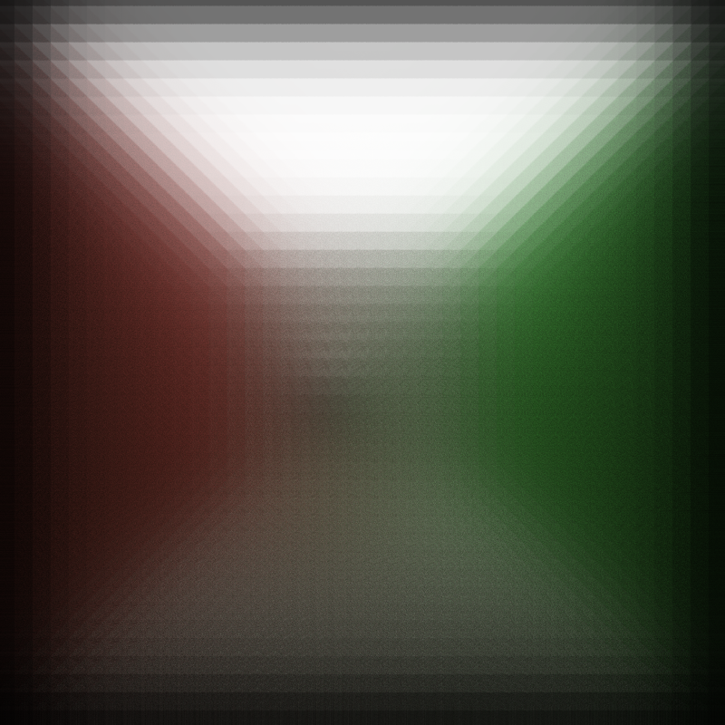
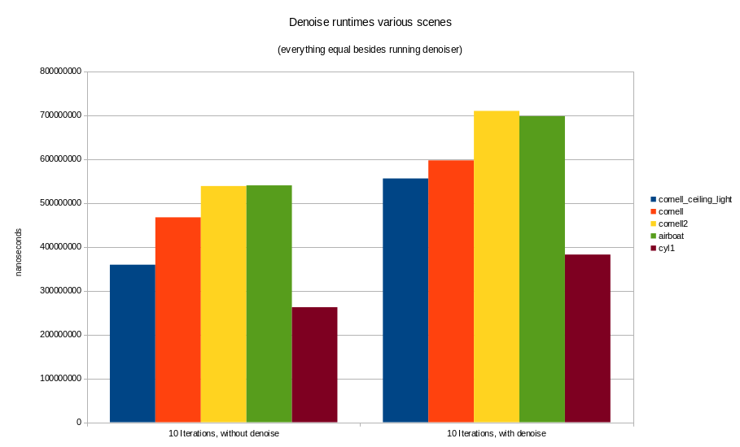

CUDA Denoiser For CUDA Path Tracer
==================================

**University of Pennsylvania, CIS 565: GPU Programming and Architecture, Project 4**

* Paul (San) Jewell
    * [LinkedIn](https://www.linkedin.com/in/paul-jewell-2aba7379), [work website](
      https://www.biociphers.org/paul-jewell-lab-member), [personal website](https://gitlab.com/inklabapp), [twitter](https://twitter.com/inklabapp).
* Tested on: Linux pop-os 5.11.0-7614-generic, i7-9750H CPU @ 2.60GHz 32GB, GeForce GTX 1650 Mobile / Max-Q 4GB

## Trading accuracy for visual acceptability

| | | 
| ----------- | -----------| 
|       |    |
| | |

In this project we implement a CUDA based version of the A-trous edge-evoiding denoise algorithm.
(See https://jo.dreggn.org/home/2010_atrous.pdf) It is implemented atop a previous version
of our general purpose path tracer. 

Simply, we do a modified Gaussian blur (modified mainly for performance reasons in CUDA, not
for edge avoiding), but weight it such that blur is less intensive along parts of the image
that we detect as 'edges' based on auxiliary information we gather from the path tracer: in 
this case, the normal and position of each point (from the first ray-bounce).

This project allows the user to modify color (traced image) weight, normal weight, and position
weight at runtime, in order to deduce where optimal results occur. However, this algorithm
in general has no method of automatically setting these parameters, so they must be hand-picked
for the scene being traced. 

| Color buffer | Normal buffer | Position buffer | 
| ----------- | -----------|-----------| 
|       |    |    |
| | | |

You can see these additional buffers above. Conceptually, you can see hot detection of edges
based on this information is certainly easier than from the original traced image. 

The overall goal of this type of blurring is to attain a much less noisey image (such as from 
path tracing with a low number of iterations) without it "looking blurry".

-----------------------

### Modified Gaussian blurring

To do the blurring part of the algorithm, we do an iterative, 25-pass method. This is 
useful both for efficiency as well as ease of implementation in CUDA. 

Experimentally, we can see that the blur approximated an exact gaussian well at low filter 
sizes, but at larger filter diameters, some boxy-ness appears, likely due to the non-cicular
method of spacing used in the calculations. 

| operation | A-trous |  Gimp 2.10.24 | 
| ----------- | -----------|-----------| 
| no blur    |    |    |
| small radius blur    |    |    |
| large radius blur    |    |    |
| | | |

luckily, our filter sizes will usually not approach the larger end of size for our needs
with de noising a path trace scene. 

-----------------------

### Performance 

Is the trade off for doing the extra work worth it? For each iteration, we will need to store
the extra normal and position information on the first bounce, we also need to copy the 
color information once in order to blur the image in CUDA without race conditions. Then, we need
to perform a fixed number of iterations (25, using the paper's implementation) for blurring.
Will it be worth it? 

First, let's look at how much extra time it adds to do our denoise algorithm on a very noisy,
10 iteration image:

We can see that, over a number of scenes, the addition of the denoising only adds 
a small yet notable fraction to the runtime. 

Now, let's check how this compares with getting a similar result using additional path
trace iterations alone:

It is immediately apparent that, on these test scenes, it would take significantly longer
to get the same results without the denoiser. So far, so good...

In some scenes, we may only get a good result by using a larger 'diameter' filter (similar
to gaussian blur radius) Will this variable ruin our performance?

Luckily, and mostly expectedly, we can see that the filter size barely has any effect on 
the runtime of one cycle. (compare to NS in last plot for scale) This makes sense, because
using the modified iterative gaussian, we do the same number of operations irrespective of
filter size. There may be some memory convalescence issues with larger filters, but we can 
see here for practical purposes, they are irrelevant. 

How about the camera resolution?

This is mixed. Unfortunately, it seems our iterative algorithm becomes significant relative 
to the path trace iterations at higher resolutions. Extrapolating this out, though, at *reasonable*
resolutions, that is, 4K or less, our denoise approach will always still be faster than 100
or more iterations of tracing. So, this approach should retain it's usefulness, at least 
until 8K or 16K displays become mainstream. :P

-----------------------

### Some qualitative notes

We have many parameters to vary in order to produce a decent image. Some of the adjustments are
very touchy to do manually, and there will surely need to be some improvements in this area
in terms of automation for this type of filter to use used in a practical way in real time.

| adjustment | lowest weight |  less weight | more weight | most weight | 
| ----------- | -----------|-----------|-----------|-----------| 
| filter size    |    |    |    |    |
| color    |    |    |    |    |
| normal    |    |    |    |    |
| position    |    |    |    |    |
| | | |

-----------------------

- the filter size seems to in general produce the greatest visual impact. 
- normal weight, somewhat surprisingly to me, has much more of an effect on the sphere
edge detection, rather than the wall/wall edges, which I thought would have a very significant
change in normal. 
- position weight is variable...I don't think this is in general too good a metric for most scenes
which have a lot of geometry close together. 
- color weight is the most useful in general, because objects edges will often have edges
of different apparent colors just due to the way that lighting / shadows physically work. 

I tried a number of scenes with different materials and more complicated geometry

On some larger or more sparse scenes, like airboat, besides the lights, I was barely able 
to get the denoiser to function at all. Some like cyl1 I was only able to get partial success. 
Based on trial and error experimentation, it seems like the range of weights and filter
sizes needed will likely change a bit depending on the scale of the scene, but I 
didn't go far enough to be sure. It seems like the demo weights are well adjusted for 
cornell. It could also be that sparse lighting in these scenes makes them *very* noisy.

| airboat | cornell2 |  cyl1 | 
| ----------- | -----------|-----------| 
|    |    |    |
| | | |

### Bonus: Comparison to Intel model-based denoiser

We are all fully aware of how well general-purpose neural networks help to enhance results
for many tasks compared to deterministic methods. For argument's sake I'll toss in a few results
from Intel's denoiser so I can feel bad about myself. >w>

||  cornell_ceiling_light | airboat | cornell2 |  cyl1 | 
| ---------- | ----------- | -----------|-----------|-----------| 
| This project| |       |    |
| Intel denoiser | |      |    |
| | | | |

On the plus side, because the intel model evaluation is on CPU only at the moment, this 
project's algorithm actually runs significantly faster for the same number of iterations. 

### OutTakes >w>

Visual weirdness worthy of documenting?

#### Disco~

#### VCR1~

#### Diamonds~

