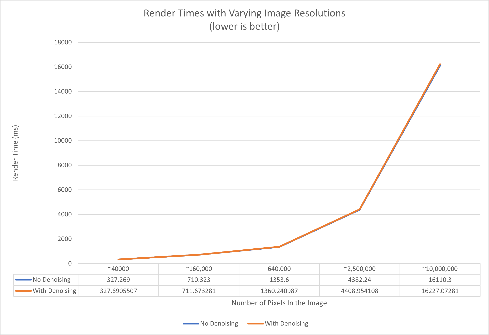
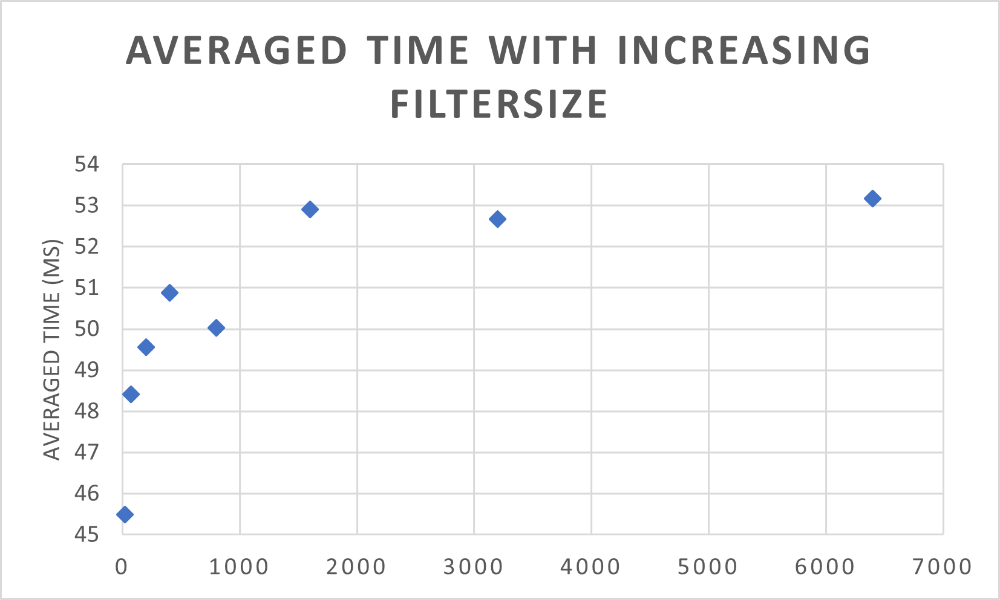
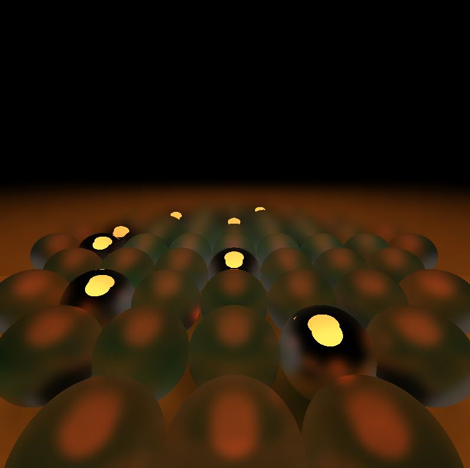

CUDA Denoiser For CUDA Path Tracer
==================================

**University of Pennsylvania, CIS 565: GPU Programming and Architecture, Project 4**

* Yuxuan Zhu
  * [LinkedIn](https://www.linkedin.com/in/andrewyxzhu/)
* Tested on: Windows 10, i7-7700HQ @ 2.80GHz 16GB, GTX 1050 4096MB (Personal Laptop)

## Demo

## Introduction

This is a GPU based path tracer with denoising capability. By performing edge aware filtering and denoising, we can dramatically improve image quality with low samples per pixel and reduce the number of samples per pixel required to generate an acceptably smooth image. For the demo scene, we are able to get a smooth image with just 50 iterations.

## Performance Analysis

The path tracer applies denoising after all the iteration has finished since this can be considered as a post processing step. Therefore, the amount of time denoising takes is constant with respect to the number of iterations and can be amortized to 0 as the number of iterations go up. The run time of denoising without optimization is on the order of 10ms. 

Denoising drastically reduces the number of iterations needed to get an acceptably smooth image. For the simple cornell box scene, the number of iteration required roughly decreases from 200 iterations to 20 iterations.

Original (200 iter) |  Denoised (20 iter)
:-------------------------:|:-------------------------:
  |  

**Denoising and Resolution**

For a constant filter size of 20x20, increasing the resolution increases the denoising runtime. Denoising runtime is roughly quadratic with respect to the horizontal resolution. This makes sense because the runtime is essentially linear with the number of pixels.

**Denoising and Filter Size**

For a fixed resolution of 800x800, increasing the filter size increases the denoising runtime. Denoising runtime is sub linear with respect to the filter side length. This also makes sense because we don't sample each pixel in the area defined by the filter. Instead we take limited samples and the larger the filter the sparser the samples.

**Qualitative Comparison**

As shown below, there is diminishing return on applying denoising as the number of samples per pixel increases.

Original (1/2/4/8/16/1000 iter) |  Denoised (1/2/4/8/16/1000 iter)
:-------------------------:|:-------------------------:
  |  
  |  
  |  
  |  
  |  
  |  

As shown below, the larger the kernel size, the smoother the image is. However, sometimes the finer details will also be smoothed out. Denoising works perfectly for diffuse surfaces like walls. It is less ideal for materials like mirror spheres because the colors on the mirror sphere are less correlated due to reflection. It is also more difficult to determine edges on a reflected sphere surface.

Original |  5x5 Filter | 20x20 Filter | 60x60 Filter | 100x100 Filter
:-------------------------:|:-------------------------:|:-------------------------:|:-------------------------:|:-------------------------:
  |   |   |    | 

Denoising also performs differently on different scenes. There are several reasons. The first is that different scene has differnt material compositions. The second reason is that scenes with bigger lights usually has less noise since light rays are more likely to terminate at a light source. Denoising also performs better in this case.

Small Light |  Big Light | Lots of Reflection 
:-------------------------:|:-------------------------:|:-------------------------:
  |   |   

## Bloopers

This image looks like it has been terribly exposed and it is caused by the program not normalziing the ray traced image by the number of iterations.

Loop unrolling

Do deniosing once after certain iterations more efficient doing it multiple times is useless.
using constant memory

iteratively updated offset

position need to divide by 10 cuz not normalized.
smaller iteration more blurry
larger kernel more blurry
There is a tradeoff between detail and noise